# Query.in

> **Crowd-sourced FAQ Generation & P2P Query Resolution Platform**


**Query.in** is a MERN stack platform where interns ask questions that can't be answered by the knowledge base. Questions escalate through a peer-review pipeline, get rated, and ultimately get resolved by moderators or admins.

---

## Project Overview

| Attribute | Value |
|-----------|-------|
| **Stack** | MongoDB, Express.js, React (Vite), Node.js, Tailwind CSS, Socket.IO, Gemini + Groq LLM APIs |
| **Design** | Strict Black (#000000) & White (#FFFFFF) theme with Yellow (#FFD000) highlight for alerts, Gold (#FFD700) for rating stars, Red (#DC2626) for critical warnings, rounded-xl corners (16px), soft shadows, modern SaaS aesthetic |
| **Auth** | JWT-based with bcrypt password hashing |
| **Roles** | Admin, Moderator, Intern |
| **Max Output Tokens** | 2000 per LLM response |
| **Query Cap** | 5 unresolved queries per intern |

---

## Core Workflow

```mermaid
graph TD
    %% ========================================
    %% 1. AUTHENTICATION & NAVIGATION
    %% ========================================
    Start[User visits Query.in] --> Login{Authenticated?}
    Login -- No --> LoginPage[Login Page]
    LoginPage --> AuthCheck{Check Role JWT}
    Login -- Yes --> AuthCheck
    
    AuthCheck -- Intern --> InternDash[Intern Dashboard]
    AuthCheck -- Moderator --> ModDash[Moderator Dashboard]
    AuthCheck -- Admin --> AdminDash[Admin Dashboard]
    
    %% ========================================
    %% 2. EXPLORE FAQS
    %% ========================================
    InternDash --> ExploreFAQ[Explore FAQs Page]
    ExploreFAQ --> CategoryFilter[Filter by Category / Global Search]
    CategoryFilter --> ReadFAQ[Read FAQ / Query Deflected]
    
    %% ========================================
    %% 3. ASK AI & SANITY CHECKS
    %% ========================================
    InternDash --> AskAI[Ask AI Portal]
    AskAI --> TypeQuery[User Types Question]
    TypeQuery --> Debounce[Debounced Auto-Complete Search]
    Debounce --> SuggestionMatch{RAG Match?}
    
    SuggestionMatch -- "Yes (clicks suggestion)" --> ReadFAQ
    
    SuggestionMatch -- "No (clicks submit)" --> SubmitQuery[Submit Full Question]
    SubmitQuery --> SanityCheck{Input Valid? <br/>Length > 2, No Garbage}
    SanityCheck -- No --> RejectGarbage[Reject: 400 Bad Request]
    SanityCheck -- Yes --> RAGSearch[Backend RAG Search Index]
    
    %% ========================================
    %% 4. AI MODERATION PIPELINE
    %% ========================================
    RAGSearch --> RAGMatch{Confidence > 50%?}
    RAGMatch -- Yes --> ReturnFAQ[Return Internal FAQ Answer]
    ReturnFAQ --> VoteFAQ{Intern Upvote?}
    VoteFAQ -- Yes --> Resolved1[Status: RAG Resolved]
    VoteFAQ -- No --> LLM
    
    RAGMatch -- No --> LLM[LLM Pipeline Triggered]
    LLM --> Gemini[Query Gemini 3.5-flash]
    Gemini --> GeminiCheck{Fails/Timeout?}
    GeminiCheck -- Yes --> Groq[Fallback to Groq LLaMA]
    GeminiCheck -- No --> ShowAnswer[Show AI Generated Answer]
    Groq --> ShowAnswer
    ShowAnswer --> VoteAI{Intern Upvote?}
    
    VoteAI -- Yes --> Resolved2[Status: LLM Resolved]
    VoteAI -- No --> SpamCheck
    
    %% ========================================
    %% 5. ESCALATION & SPAM PREVENTION
    %% ========================================
    SpamCheck{Similar Query<br/>Already in Queue?}
    SpamCheck -- Yes --> BlockSpam[Block: Duplicate Query Detected]
    SpamCheck -- No --> CheckCap{Active Queries >= 5?}
    
    CheckCap -- Yes --> BlockCap[Block: Escalation Limit Reached]
    CheckCap -- No --> AddToQueue[Added to Peer Queue<br/>Status: Pending]
    
    AddToQueue --> NoFaqTracking[Log in NoFaq Tracking Collection]
    NoFaqTracking --> NoFaqCount{Hits 10 Occurrences?}
    NoFaqCount -- Yes --> AlertAdmin[AI Suggestion:<br/>Alert Admin to Create FAQ]
    NoFaqCount -- No --> WaitPeer[Query Visible to Peer Crowd]
    
    %% ========================================
    %% 6. CROWD-SOURCED PEER QUEUE
    %% ========================================
    WaitPeer --> PeerAnswers[Peers Submit Answers]
    PeerAnswers --> MaxPeers{Max 5 Peers Reached?}
    MaxPeers -- No --> MorePeers[Accept More Answers]
    MaxPeers -- Yes --> WaitRating[Lock to New Answers]
    
    WaitPeer --> AuthorRates[Query Author Reviews & Rates]
    AuthorRates --> RatingValue{Rating / Flags}
    
    %% Rating Logic
    RatingValue -- "5 Stars" --> Lock5[Lock Query Instantly]
    Lock5 --> AdminHigh[Admin: Pending Resolution Queue]
    
    RatingValue -- "4 Stars" --> AdminHigh
    
    RatingValue -- "1-3 Stars" --> Check5[Has 5 Low Responses?]
    Check5 -- Yes --> LockLow[Lock Query]
    LockLow --> AdminLow[Admin: Low-Rated Queue]
    Check5 -- No --> TimeCheck[24 hours passed?]
    TimeCheck -- Yes --> AdminStagnant[Admin: Stagnant Queue]
    
    %% Ambiguous Logic
    RatingValue -- "Mark Ambiguous" --> StrikeCheck{3 Peers Marked?}
    StrikeCheck -- Yes --> LockAmb[Lock Query: 3-Strike]
    LockAmb --> NotifyAuthor[Notify Intern to Rephrase]
    LockAmb --> AdminAmb[Admin: Ambiguous Queue]
    
    %% ========================================
    %% 7. ADMIN / MODERATOR RESOLVE HUB
    %% ========================================
    AdminHigh --> AdminResolveHub[Admin/Moderator Resolve Hub]
    AdminLow --> AdminResolveHub
    AdminStagnant --> AdminResolveHub
    AdminAmb --> AdminResolveHub
    
    AdminResolveHub --> HubAction{Action Taken}
    
    HubAction -- "Warn Intern" --> IssueWarning[Add Strike to Warning System]
    IssueWarning --> DisableCheck{5 Warnings?}
    DisableCheck -- Yes --> BanUser[Disable User Account]
    
    HubAction -- "Delete" --> Trash[Delete Query Permanently]
    
    HubAction -- "Approve / Override" --> Terminal[Status: Resolved]
    
    %% ========================================
    %% 8. TERMINAL STATE & FAQ CREATION
    %% ========================================
    Terminal --> CheckRole{User Role?}
    
    CheckRole -- "Admin" --> AdminAddFAQ{Click 'Add to FAQ'?}
    AdminAddFAQ -- "Yes" --> CreateFAQ[New Knowledge Base Entry Created]
    AdminAddFAQ -- "No" --> End[Flow Complete]
    
    CheckRole -- "Moderator" --> ModSuggestFAQ{Click 'Suggest FAQ'?}
    ModSuggestFAQ -- "Yes" --> ModSuggestQ[Admin: Moderator Suggested Queue]
    ModSuggestFAQ -- "No" --> End
    
    ModSuggestQ --> AdminFinalReview{Admin Final Review}
    AdminFinalReview -- "Approve" --> CreateFAQ
    AdminFinalReview -- "Dismiss" --> End
```



---

## LLM Model Fallback

**Gemini Models (in order):**
| Model | Use Case |
|-------|----------|
| `gemini-3.5-flash` | Default - text, multimodal, agentic tasks |
| `gemini-3.1-pro-preview` | Complex reasoning, advanced coding |
| `gemini-3.1-flash-lite` | Cost-efficient, high-frequency, simple tasks |
| `gemini-2.5-flash` | Legacy stable |
| `gemini-2.5-pro` | Legacy heavy-lifter |

**Groq Models (free tier, in order):**
| Model | Use Case |
|-------|----------|
| `llama-3.3-70b-versatile` | Summarization, complex logic, deep reasoning |
| `llama-3.1-8b-instant` | High-volume, quick chat, basic tasks |
| `llama-4-scout-17b` | **Multimodal (images!)**, 128k context |
| `qwen3-32b` | Coding, multilingual reasoning |
| `gpt-oss-120b` | Heavy-duty step-by-step reasoning |
| `gpt-oss-20b` | Lighter reasoning tasks |

**LLM Response Rules:**
- No emojis
- No special formatting (bold, italics, #, *)
- Plain text only
- Concise, short answers
- Max 2000 output tokens

---

## Documentation Directory

| Document | Description |
|----------|-------------|
| [query.pdf](./query.pdf) | Minimum Viable Product (MVP) specifications and initial requirements |
| [transcript.pdf](./transcript.pdf) | Team discussion and brainstorming transcript |
| [context.md](./context.md) | Complete project context, resolved issues, and development logs |
| [./docs/workflow_chart.md](./docs/workflow_chart.md) | End-to-end user journey and system workflow Mermaid flowchart |
| [./docs/FEATURES.md](./docs/FEATURES.md) | Complete feature breakdown with flagship highlights |
| [./docs/setup_guide.md](./docs/setup_guide.md) | Installation, configuration, and startup instructions |
| [./docs/architecture.md](./docs/architecture.md) | System architecture, React/Vite, Express routing, Socket.IO |
| [./docs/representation.md](./docs/representation.md) | System flow charts and state machine visual representations |
| [./docs/api_docs.md](./docs/api_docs.md) | REST API endpoint reference with request/response formats |
| [./docs/database_schema.md](./docs/database_schema.md) | Mongoose model reference with ObjectId relationships |

---

## Quick Start

```bash
# Backend
cd backend
npm install
npm run dev

# Frontend (new terminal)
cd frontend
npm install
npm run dev
```

*For instructions on how to share your local environment for internet testing using Ngrok, see the [Setup Guide](docs/setup_guide.md#45-internet-testing-with-ngrok-optional).*

---

## Environment Variables

### Backend (.env)
```env
PORT=5000
MONGO_URI=mongodb+srv://<user>:<pass>@<cluster>/faq_escalation
JWT_SECRET=your-secret-key
GEMINI_API_KEY=your-gemini-api-key
GROQ_API_KEY=your-groq-api-key
CLIENT_URL=http://localhost:5173
NODE_ENV=development
```

### Frontend (.env)
```env
VITE_API_URL=http://localhost:5000/api
```

---

## Test Accounts

| Role | Email | Password |
|------|-------|----------|
| Admin | admin@query.in | Admin@1234 |
| Moderator | mod@query.in | Mod@1234 |
| Moderator | mod2@query.in | Mod2!1234 |
| Intern 1 | intern1@query.in | Intern1@1234 |
| Intern 2 | intern2@query.in | Intern2@1234 |
| Intern 3 | intern3@query.in | Intern3@1234 |
| Intern 4-10 | intern{N}@query.in | Intern{N}!234 |

---

## Analytics Tracking

All query resolutions are tracked with ResolutionType:

| Type | Description |
|------|-------------|
| `AUTO_COMPLETE` | Resolved via auto-complete suggestion |
| `RAG_RESOLVED` | RAG found answer, user upvoted |
| `LLM_RESOLVED` | LLM answered (Gemini or Groq) |
| `ESCALATED` | Downvoted, sent to peer queue |
| `SPAM_BLOCKED` | Similar query already in queue |
| `CAP_BLOCKED` | 5 active queries reached |
| `MODERATOR_OVERRIDE` | Moderator resolved query (not yet implemented) |

---

## Recent Fixes

| # | Issue | Fix |
|---|-------|-----|
| 20 | MyEscalations socket connection failed | Added VITE_API_URL fallback before .replace() |
| 21 | Sweeper edge case | Fixed responseCount <= 4 to use MAX_PEER_RESPONSES constant |
| 22 | Ambiguous 3-strike notification | Intern now notified when query marked ambiguous |
| 23 | createFAQFromQuery stub | Now actually creates FAQ from approved response |
| 24 | Missing Stagnant Queue | Added 6th section in Admin Resolution Hub |
| 25 | AskAI generic error message | Now shows actual backend error (e.g., "Escalation blocked: You have 5 unresolved queries.") |
| 26 | No way to clear test escalation data | Added POST /api/admin/clear-all-data endpoint |
| 27 | Race condition in submitAnswer | Atomic `findOneAndUpdate` with `$expr` checks responses.length < 5 DURING update |
| 28 | N+1 query in sweeper | Aggregation pipeline + `updateMany` instead of for-loop with sequential queries |
| 29 | Incorrect telemetry logging | `synthesizeWithGemini/Grok` now return `{ answer, model }` instead of just answer |
| 30 | ProtectedRoute redirected to /login | Login form embedded on Landing page at `/`, redirect now to `/` |
| 31 | ViewFAQs markdown not rendering | Added react-markdown for proper rendering |
| 32 | ViewFAQs missing status badges | Added "AI Generated", "Peer Answered", "Verified by Admin" badges |
| 33 | ViewFAQs auto-expand on load | Removed auto-expand, categories start collapsed |
| 34 | Peer queue empty after first answer | getPeerQueue now queries status: { $in: ['Pending', 'Peer Answered'] } |
| 35 | Intern who answered sees own response in queue | Added exclusion for queries user already answered |
| 36 | Submit answer rejected for Peer Answered status | Atomic update now matches both 'Pending' and 'Peer Answered' status |
| 37 | Notifications not stored before client response | Moved await createNotification before res.json() in all controllers |
| 38 | MyEscalations rating UI - can rate multiple times | "Rate this response" button only shows if rating === null, added rater_note field |
| 39 | 4-star rating locks query immediately | Changed MIN_HIGH_RATING to 5; 4 stars = Highly-Rated Queue (not locked) |
| 40 | Ambiguous marked query still visible in peer queue | Added ambiguous_marked_by filter to exclude queries user marked ambiguous |
| 41 | 3-strike ambiguous query shows "Pending" status on MyEscalations | Added `query_resolved` socket emit when query becomes Ambiguous |
| 46 | No warning system for intern misuse | Added warning_count and is_disabled to User model, warnIntern endpoint, Spoiled Users page |
| 47 | Failed to send warning (500 error) | Added 'intern_warning' to Notification type enum |
| 48 | MyEscalations shows "Resolved" instead of "Approved" | Both peer_approved and admin_override show "Approved" badge |
| 49 | Sidebar shows only current page nav items | Created centralized navConfig.jsx, DashboardLayout auto-detects nav items by user role |
| 50 | Intern dashboard stats incorrect | Active queries showed all queries not just user's, peer responses included skipped/ambiguous | Created GET /api/peer/stats endpoint with accurate counts, Active Queries and Resolved cards now link to My Escalations |
| 51 | Ask AI page input limitations | Single-line input couldn't handle multiline questions; "Get Answer" button separate from input | Replaced input with textarea (Shift+Enter for new line, Enter to submit), replaced bulb icon with send button (right arrow) on input bar |
| 52 | Auto-complete dropdown not closing on Enter | Enter key didn't close suggestions | Added setShowSuggestions(false) and setSuggestions([]) in handleKeyDown |
| 53 | Thumbs up/down icons improper | Old SVG paths were broken/not proper | Replaced with clean Material Design thumbs up/down icons |
| 54 | Browse FAQs button had no border | Button border-white made it invisible on black card | Changed to variant="secondary" with proper black border |
| 55 | Question mark icon not centered | Icon was slightly off-center | Adjusted icon size to w-12 h-12, reduced strokeWidth |
| 56 | Ask AI and Browse FAQs buttons lacked hover effect | No visual feedback on hover | Added hover:scale-105 transition-transform |
| 57 | Multiple pages lacked hover effects | Cards, buttons, inputs felt static | Added hover effects across pages - scale, shadow, background transitions |
| 58 | Read-only stars shown when not rated yet | View-only stars displayed for unrated responses | Wrapped read-only stars in `response.rating !== null` condition |
| 59 | Suggestions dropdown stays open after submit | Debounced search could fire after submit | Added cancelDebounce() to clear pending timeout on submit |
| 60 | Escalated/Resolved cards had yellow checkmark and button | Color scheme inconsistent with success state | Changed to green checkmark (bg-green-500) and black button (variant="primary") |
| 61 | Star ratings and status badges had inconsistent colors | text-yellow-600 hardcoded, no color-coded status | Changed to text-yellow-500, added pending (blue) and peer (yellow) badge variants |
| 62 | Separate User Registration, User Management, and Spoiled Users pages | Three different pages for related functionality | Combined into single AdminUserManagement page with registration accordion, user table with warnings column, and 3-dot menu for active/inactive toggle |
| 63 | Pending Resolution showed all responses | Low-rated responses (1-3★) were visible in Pending Resolution section | Filter to show only 4-5★ responses in Pending Resolution, sorted 5★ first |
| 64 | Low-Rated queue showed mixed queries | Queries with some high ratings were shown in Low-Rated queue | Low-Rated now shows only queries with ALL responses rated 1-3★, responses sorted descending with Approve button |
| 65 | "Stagnant" category misleading name and criteria | Named "Stagnant (0 answers)" but new criteria is different | Renamed to "Stagnant (Locked, 24h+)", now requires 1-4 low-rated responses (1-3★) AND 24+ hours old |
| 66 | "Unanswered" category redundant | Unanswered and Stagnant were overlapping/confusing | Removed "Unanswered" category |
| 67 | Archive section showed all responses | When viewing resolved queries in Archive, all responses were shown instead of just approved | Filter Archive section to only show `approval === true` response |
| 68 | "Add to FAQ Database" too basic | Simple confirm() dialog didn't allow customization of tags, keywords, priority, category | Replaced with full modal form with category dropdown, tags, keywords, priority fields |
| 69 | Category dropdown hardcoded | Category list was hardcoded in frontend instead of using existing database categories | Added GET /api/faqs/categories endpoint, dropdown dynamically populated from database |
| 75 | Show password toggle missing | No way to see password while typing | Added show/hide password toggle with eye icons on Landing page login form |
| 76 | Login page refreshes on wrong password | 401 interceptor redirected to /login on all 401 errors including login attempts | Modified api.js to skip redirect when URL contains `/auth/login` |
| 77 | Demo credentials visible on login card | Security risk - credentials shown publicly | Removed demo credentials section from Landing page login card |
| 78 | Login card missing border | Explore FAQs card had border but Login card didn't | Added `border border-gray-200` to Login card for consistency |
| 79 | Moderator response shown as "Admin" in intern's MyEscalations | Backend didn't populate resolved_by for admin/moderator approval | Added populate('resolved_by', 'email role') in getMyEscalations; Response badges now show Admin/Moderator Approved vs Override based on approval flag and resolved_by.role |
| 80 | Duplicate "Approved" badge on responses | Redundant badge showing for approved responses | Removed duplicate badge; first badge now correctly shows "Admin Approved", "Moderator Approved", or "Admin/Moderator Override" |
| 82 | peer_note not visible in AdminResolveHub | Response detail panel didn't show internal note | Added peer_note display with "Peer Note:" label in all admin/moderator query views |
| 83 | Announcement priority missing | No way to set urgency level for announcements | Added priority field (low/medium/high) with color coding: dark green/yellow/red |
| 84 | Admin dropdown included Admin role | Only one admin should exist per application | Removed Admin option from role dropdown in user registration page |
| 85 | Moderator suggestion didn't show sender | Admin couldn't see which moderator suggested FAQ | Added "From: {email} ({role})" display in moderator suggestion header and response section |
| 86 | rater_note not visible in admin query views | Admin couldn't see intern's review note when approving responses | Added "Author's Review Note:" display with blue styling in all admin/moderator query detail views |
| 87 | Moderator Suggested list missing "From" field | Admin couldn't identify moderator from query list, only in detail panel | Added "From: {email} ({role})" display in query list items, shows question_text instead of suggestion text, role badge instead of response count |
| 88 | Query Monitor still in moderator dashboard | Query Monitor route and card still existed after removal attempt | Completely removed Query Monitor: deleted ModeratorQueries component, route, nav card, and overview card |
| 89 | Stagnant queries with 0 responses not appearing in Stagnant tab | Stagnant filter excluded queries with 0 responses | Fixed filter to handle 0 responses case: if no responses and 24+ hours old, query is stagnant |
| 90 | Similar query blocking doesn't notify interested interns | When intern A's similar query is blocked, they aren't notified when intern B's query is resolved | Added SimilarQueryInterest model, track interests on block, create shadow query and notify when original query is resolved |
| 81 | Database schema not updated with response approval states | Missing documentation for response_type and approval combinations | Added Response Type & Approval States table in database_schema.md |

---

## Notification System

Hybrid real-time + MongoDB persistence model for instant and offline alerts.

| Type | Trigger | Recipient |
|------|---------|-----------|
| `peer_answer` | Peer submits answer | Query author (intern) |
| `query_resolved` | Admin resolves OR query marked ambiguous | Query author (intern) |
| `admin_alert` | NoFaq hits 10 occurrences | All admins |
| `announcement` | Admin creates broadcast | All interns |
| `faq_added` | Admin adds new FAQ | All interns |
| `intern_warning` | Admin sends warning to intern for misuse | Targeted intern |

**Components:**
- `NotificationBell` - Top bar bell icon with unread badge and dropdown
- `Toast` - Slide-in pop-up from bottom-right (auto-dismiss 5s)
- `NotificationContext` - Socket.IO client + state management

**Real-time Events:**
- `new_notification` - Broadcast to user room
- `yellow_alert` - Broadcast to admin room when NoFaq hits threshold
- `query_resolved` - Intern notified when their query is resolved
- `new_peer_answer` - Intern notified when peer answers their query

---

## Warning & Credibility System

Admins/Moderators can send warnings to interns from any query detail panel.

| Feature | Description |
|---------|-------------|
| `warning_count` | User field (default: 0, max: 5) |
| `is_disabled` | Auto-enabled when warning_count >= 5 |
| Login Block | Disabled users cannot log in (403 error) |
| Spoiled Users Page | `/admin/spoiled-users` lists all users with warnings |
| Warning Badge | Query detail panels show warning count next to intern email |
| Warning Banner | MyEscalations page shows warning count if user has warnings |

**Warning Flow:**
1. Admin clicks "Send Warning" in query detail panel
2. Modal appears with optional warning message
3. On submit: `warnIntern()` increments `warning_count`
4. If `warning_count >= 5`: `is_disabled = true`, user cannot log in
5. `intern_warning` notification sent to intern

---

## Admin Dashboard Pages

The Admin Dashboard now uses a page-based structure with sidebar navigation:

| Page | Route | Purpose |
|------|-------|---------|
| Dashboard | /admin | Overview with navigation cards (5 cards) |
| User Management | /admin/users | Combined: Registration, User list with warnings (0=green, 1+=yellow, 5=red), Active/Inactive toggle (green/red) |
| Announcements | /admin/announcement | Publish announcements |
| FAQ Editor | /admin/faqs | FAQ CRUD operations |
| Query Management | /admin/resolve | Resolution queue (includes Pending Resolution, Ambiguous, Stagnant, Low-Rated, Archive, Moderator Suggested) |
| AI Suggestions | /admin/suggestions | FAQ gap suggestions |

## Moderator Dashboard Pages

| Page | Route | Purpose |
|------|-------|---------|
| Dashboard | /moderator | Overview with navigation cards |
| Resolve Hub | /moderator/resolve | Resolution queue (includes Pending Resolution, Stagnant, Low-Rated, Archive) |

---

## 6-Section Admin Resolution Hub

The Admin Dashboard presents 6 sections for managing escalated queries:

| Section | Condition |
|---------|-----------|
| Pending Resolution | High-rated queries (rating >= 4), excludes Ambiguous and Resolved. **Only 4-5★ responses shown, sorted 5★ first** |
| Ambiguous Queries | Queries marked unclear by 3 peers (3-strike rule), can delete these |
| Stagnant (Locked, 24h+) | Queries with 1-4 low-rated responses (all 1-3★), created 24+ hours ago |
| Low-Rated | Queries with 5+ responses ALL rated < 4 stars. **All responses shown (sorted 3★→1★) with Approve button** |
| Archive | status = 'Resolved' |
| Moderator Suggested | Pending FAQ suggestions from moderators. Admin can Add to FAQ or Dismiss |

**FAQ Creation Bridge:** Admin can click "+ Add to FAQ Database" on any resolved query to create a permanent FAQ entry.

---

## License

Internal project - All rights reserved.