# Query.in - Problem Statement & Crowd-Sourced Solution

## Overview

**Query.in** is a **crowd-sourced FAQ platform** that leverages collective intelligence to resolve intern queries efficiently. Instead of relying solely on admins or AI, the platform enables interns to help each other through a structured peer-review workflow, while AI assists where human knowledge falls short.

---

## Crowd-Sourcing Model

### How It Works

The platform follows a **democratic, crowd-sourced approach** to knowledge sharing:

```
┌─────────────────────────────────────────────────────────────────────────────┐
│                        CROWD-SOURCING PRINCIPLE                              │
│                                                                              │
│   ┌─────────┐    ┌─────────┐    ┌─────────┐    ┌─────────┐                  │
│   │ Intern  │ →  │  Peer   │ →  │ Rating  │ →  │ Admin   │                  │
│   │  Asks   │    │ Answers │    │ System  │    │ Review  │                  │
│   └─────────┘    └─────────┘    └─────────┘    └─────────┘                  │
│                                                                              │
│   Each intern contributes → All interns benefit → Knowledge grows organically │
└─────────────────────────────────────────────────────────────────────────────┘
```

### Crowd-Sourcing Benefits

| Traditional Approach | Query.in Crowd-Sourced Approach |
|---------------------|----------------------------------|
| Admin answers all queries | Interns answer each other's questions |
| Knowledge siloed with experts | Knowledge distributed across community |
| Slow response times | Fast peer answers from those who know |
| Admin burnout | Workload shared across all interns |
| Static FAQ updates | Dynamic FAQ expansion from resolved queries |
| Single point of failure | Multiple peers can answer same query |

---

## Problem Statement

### 1. Query Repetition (Crowd-Sourcing Challenge)

- **Problem:** Multiple interns ask the same questions repeatedly
- **Impact:** Redundant effort, RAG finds same matches, LLM generates similar answers
- **Result:** Knowledge base not utilized, time wasted on duplicate queries

### 2. Delay in Answer (Crowd-Sourcing Challenge)

- **Problem:** Interns wait extended periods for answers to their queries
- **Impact:** When FAQ doesn't match, user waits for LLM; if LLM fails, waits for peer responses
- **Result:** Poor user experience, reduced productivity, potential dropout

### 3. Workload on Admin (Without Crowd-Sourcing)

- **Problem:** Admin bears brunt of resolving all escalated queries manually
- **Impact:** With hundreds of interns and thousands of queries, admin becomes bottleneck
- **Result:** Slow resolution times, admin burnout, system inefficiency

### 4. Ambiguous Queries and Low-Quality Answers (Without Quality Control)

- **Problem:** Unclear questions lead to irrelevant responses; low-quality answers waste time
- **Impact:** Peers spend time answering questions that don't make sense
- **Result:** 3-strike rule triggers, query locks, intern frustration, polluted FAQ suggestions

---

## Solutions Implemented (Crowd-Sourced)

### Solution 1: Query Repetition → RAG-Based Auto-Complete & FAQ Knowledge Base

**Features Implemented:**
- **Auto-complete Suggestions:** As interns type, system shows matching FAQs in real-time (300ms debounce)
- **RAG Search:** MongoDB text index on `search_text`, `tags`, `keywords` finds matching FAQs
- **FAQ Database:** 125+ pre-loaded FAQs covering common topics
- **Instant Resolution:** Selecting autocomplete suggestion = immediate answer without escalation
- **No-FAQ Tracking:** Queries that fail RAG/LLM are tracked; 10+ occurrences trigger FAQ suggestion

**Crowd-Sourcing Aspect:** Resolved queries can be added to FAQ database, expanding shared knowledge

---

### Solution 2: Delay in Answer → Multi-Provider LLM + Peer Crowd

**Features Implemented:**
- **Gemini LLM:** Primary AI with 5 models (3.5-flash → 3.1-pro → 3.1-flash-lite → 2.5-flash → 2.5-pro)
- **Groq LLM:** Free-tier fallback with 6 models (llama-3.3-70b → llama-3.1-8b → ...)
- **Automatic Fallback:** If one model fails/times out, system switches seamlessly
- **Peer Queue:** Interns can answer others' queries (max 5 responses per query)
- **Real-time Notifications:** Socket.IO alerts when peer answers query

**Crowd-Sourcing Aspect:** Instead of waiting for admin, ANY intern in the peer queue can answer

---

### Solution 3: Workload on Admin → Peer Rating System & Crowd Review

**Features Implemented:**
- **Peer Rating (1-5 stars):** Query authors rate peer answers
- **High-Rating Lock:** 5-star rating immediately locks query for admin review
- **Low-Rating Lock:** 1-3 stars with 5 responses locks query for admin review
- **24-Hour Sweeper:** Automated cron job locks stale queries
- **5-Section Resolve Hub:** Admin/Moderator can batch-process by category
- **Bulk Operations:** Approve/Override with page refresh

**Crowd-Sourcing Aspect:** The CROWD (peer interns) does the initial answering; admin only reviews

---

### Solution 4: Ambiguous Queries → 3-Strike Rule & Quality Control

**Features Implemented:**
- **Query Input Sanity Check:** Frontend + Backend validation blocks garbage inputs
- **Ambiguous Marking:** Peers can mark query as unclear
- **3-Strike Rule:** 3 different peers marking ambiguous → Query becomes `Ambiguous`, `is_locked: true`
- **Intern Notification:** When query becomes ambiguous, intern notified to rephrase
- **Rating System:** Query authors rate responses, ensuring quality feedback

**Crowd-Sourcing Aspect:** The crowd flags low-quality queries; quality control is distributed

---

## Complete Query Lifecycle Workflow

```
┌─────────────────────────────────────────────────────────────────────────────┐
│                           QUERY LIFECYCLE                                    │
│                        Intern submits query                                   │
└─────────────────────────────────────────────────────────────────────────────┘

STEP 0: AUTO-COMPLETE (as user types)
│
├─ User types in AskAI input
├─ debounce 300ms → GET /api/ask/autocomplete?q=...
├─ RAG keyword search on FAQ keywords, tags, search_text
├─ Returns up to 5 matching FAQs
└─ User selects → instant resolution (source: 'autocomplete')

STEP 1: RAG SEARCH (on submit)
│
├─ User submits full question → POST /api/ask
├─ RAG keyword matching (search_text, tags, keywords)
├─ Match confidence > 50%?
│   ├─ YES → Return FAQ answer for upvote/downvote
│   │       ├─ UPVOTE → Resolution logged (RAG_RESOLVED), query ends
│   │       └─ DOWNVOTE → Go to STEP 2 (LLM Fallback)
│   └─ NO → Go to STEP 2 (LLM Fallback)

STEP 2: LLM FALLBACK (Gemini → Groq)
│
├─ Gemini 3.5-flash → synthesize context from matching FAQs
├─ If fails → try next model (3.1-pro, 3.1-flash-lite, 2.5-flash, 2.5-pro)
├─ All Gemini models fail → try Groq (llama-3.3-70b → llama-3.1-8b → ...)
├─ LLM returns answer → user sees answer with upvote/downvote buttons
│   ├─ UPVOTE → Resolution logged (LLM_RESOLVED), query ends
│   └─ DOWNVOTE → Go to STEP 3 (Peer Escalation)

STEP 3: PEER ESCALATION (if LLM fails or downvoted)
│
├─ Check active query cap (max 5 unresolved per intern)
├─ Check for similar query spam
├─ Create Query document (status: 'Pending')
├─ Track in NoFaq collection (for FAQ suggestions)
└─ Query enters Peer Queue (CROWD-SOURCING BEGINS)

STEP 4: PEER ANSWERS (max 5 peers) - CROWD IN ACTION
│
├─ Other interns see query in Peer Queue
├─ Intern submits answer → POST /api/peer/answer
├─ Query status changes: 'Pending' → 'Peer Answered'
├─ Notification sent to query author (peer_answer)
└─ Query author rates the response (1-5 stars)

STEP 5: RATING & LOCKING - QUALITY CONTROL
│
├─ 5 stars → Query immediately locked
│   └─ Escalates to Admin "Highly-Rated Queue"
│
├─ 4 stars → Query escalates to "Highly-Rated Queue" (NOT locked)
│
├─ 1-3 stars (LOW) + 5 responses filled → Query locked
│   └─ Escalates to Admin "Low-Rated Queue"
│
└─ Ambiguous: 3 different peers mark query as ambiguous
    └─ Query status → 'Ambiguous', is_locked: true
    └─ Intern notified: "Your query was unclear. Please rephrase."

STEP 6: ADMIN RESOLUTION - FINAL REVIEW
│
├─ Admin views escalated queries (Resolve Hub - 5 sections)
├─ Options:
│   ├─ APPROVE PEER RESPONSE → Query resolved (peer_approved)
│   ├─ ADMIN OVERRIDE → Query resolved (admin_override)
│   └─ ADD TO FAQ → Creates permanent FAQ entry
└─ Notification sent to intern (query_resolved)

STEP 7: RESOLVED (Terminal State) - KNOWLEDGE CREATED
│
└─ Query marked as 'Resolved', is_locked: true
└─ "Add to FAQ" button available for knowledge base expansion
```

---

## Visual Flow Chart

```mermaid
graph TD
    %% ========================================
    %% 1. AUTHENTICATION & NAVIGATION
    %% ========================================
    Start[User visits Query.in] --> Login{Authenticated?}
    Login -- No --> LoginPage[Login Page]
    LoginPage --> AuthCheck{Check Role JWT}
    Login -- Yes --> AuthCheck
    
    AuthCheck -- Intern --> InternDash[Intern Dashboard]
    AuthCheck -- Moderator --> ModDash[Moderator Dashboard]
    AuthCheck -- Admin --> AdminDash[Admin Dashboard]
    
    %% ========================================
    %% 2. EXPLORE FAQS
    %% ========================================
    InternDash --> ExploreFAQ[Explore FAQs Page]
    ExploreFAQ --> CategoryFilter[Filter by Category / Global Search]
    CategoryFilter --> ReadFAQ[Read FAQ / Query Deflected]
    
    %% ========================================
    %% 3. ASK AI & SANITY CHECKS
    %% ========================================
    InternDash --> AskAI[Ask AI Portal]
    AskAI --> TypeQuery[User Types Question]
    TypeQuery --> Debounce[Debounced Auto-Complete Search]
    Debounce --> SuggestionMatch{RAG Match?}
    
    SuggestionMatch -- "Yes (clicks suggestion)" --> ReadFAQ
    
    SuggestionMatch -- "No (clicks submit)" --> SubmitQuery[Submit Full Question]
    SubmitQuery --> SanityCheck{Input Valid? <br/>Length > 2, No Garbage}
    SanityCheck -- No --> RejectGarbage[Reject: 400 Bad Request]
    SanityCheck -- Yes --> RAGSearch[Backend RAG Search Index]
    
    %% ========================================
    %% 4. AI MODERATION PIPELINE
    %% ========================================
    RAGSearch --> RAGMatch{Confidence > 50%?}
    RAGMatch -- Yes --> ReturnFAQ[Return Internal FAQ Answer]
    ReturnFAQ --> VoteFAQ{Intern Upvote?}
    VoteFAQ -- Yes --> Resolved1[Status: RAG Resolved]
    VoteFAQ -- No --> LLM
    
    RAGMatch -- No --> LLM[LLM Pipeline Triggered]
    LLM --> Gemini[Query Gemini 3.5-flash]
    Gemini --> GeminiCheck{Fails/Timeout?}
    GeminiCheck -- Yes --> Groq[Fallback to Groq LLaMA]
    GeminiCheck -- No --> ShowAnswer[Show AI Generated Answer]
    Groq --> ShowAnswer
    ShowAnswer --> VoteAI{Intern Upvote?}
    
    VoteAI -- Yes --> Resolved2[Status: LLM Resolved]
    VoteAI -- No --> SpamCheck
    
    %% ========================================
    %% 5. ESCALATION & SPAM PREVENTION
    %% ========================================
    SpamCheck{Similar Query<br/>Already in Queue?}
    SpamCheck -- Yes --> BlockSpam[Block: Duplicate Query Detected]
    SpamCheck -- No --> CheckCap{Active Queries >= 5?}
    
    CheckCap -- Yes --> BlockCap[Block: Escalation Limit Reached]
    CheckCap -- No --> AddToQueue[Added to Peer Queue<br/>Status: Pending]
    
    AddToQueue --> NoFaqTracking[Log in NoFaq Tracking Collection]
    NoFaqTracking --> NoFaqCount{Hits 10 Occurrences?}
    NoFaqCount -- Yes --> AlertAdmin[AI Suggestion:<br/>Alert Admin to Create FAQ]
    NoFaqCount -- No --> WaitPeer[Query Visible to Peer Crowd]
    
    %% ========================================
    %% 6. CROWD-SOURCED PEER QUEUE
    %% ========================================
    WaitPeer --> PeerAnswers[Peers Submit Answers]
    PeerAnswers --> MaxPeers{Max 5 Peers Reached?}
    MaxPeers -- No --> MorePeers[Accept More Answers]
    MaxPeers -- Yes --> WaitRating[Lock to New Answers]
    
    WaitPeer --> AuthorRates[Query Author Reviews & Rates]
    AuthorRates --> RatingValue{Rating / Flags}
    
    %% Rating Logic
    RatingValue -- "5 Stars" --> Lock5[Lock Query Instantly]
    Lock5 --> HubHigh[Resolve Hub: Pending Resolution]
    
    RatingValue -- "4 Stars" --> HubHigh
    
    RatingValue -- "1-3 Stars" --> Check5[Has 5 Low Responses?]
    Check5 -- Yes --> LockLow[Lock Query]
    LockLow --> HubLow[Resolve Hub: Low-Rated Queue]
    Check5 -- No --> TimeCheck[24 hours passed?]
    TimeCheck -- Yes --> HubStagnant[Resolve Hub: Stagnant Queue]
    
    %% Ambiguous Logic
    RatingValue -- "Mark Ambiguous" --> StrikeCheck{3 Peers Marked?}
    StrikeCheck -- Yes --> LockAmb[Lock Query: 3-Strike]
    LockAmb --> NotifyAuthor[Notify Intern to Rephrase]
    LockAmb --> HubAmb[Resolve Hub: Ambiguous Queue]
    
    %% ========================================
    %% 7. ADMIN / MODERATOR RESOLVE HUB
    %% ========================================
    ModDash --> ResolveHub[Admin & Moderator Resolve Hub]
    AdminDash --> ResolveHub
    
    HubHigh --> ResolveHub
    HubLow --> ResolveHub
    HubStagnant --> ResolveHub
    HubAmb --> ResolveHub
    
    ResolveHub --> HubAction{Action Taken}
    
    HubAction -- "Warn Intern" --> IssueWarning[Add Strike to Warning System]
    IssueWarning --> DisableCheck{5 Warnings?}
    DisableCheck -- Yes --> BanUser[Disable User Account]
    
    HubAction -- "Delete" --> Trash[Delete Query Permanently]
    
    HubAction -- "Approve / Override" --> Terminal[Status: Resolved]
    
    %% ========================================
    %% 8. TERMINAL STATE & FAQ CREATION
    %% ========================================
    Terminal --> CheckRole{Resolver Role?}
    
    CheckRole -- "Admin" --> AdminAddFAQ{Click 'Add to FAQ'?}
    AdminAddFAQ -- "Yes" --> CreateFAQ[New Knowledge Base Entry Created]
    AdminAddFAQ -- "No" --> End[Flow Complete]
    
    CheckRole -- "Moderator" --> ModSuggestFAQ{Click 'Suggest FAQ'?}
    ModSuggestFAQ -- "Yes" --> ModSuggestQ[Admin: Moderator Suggested Queue]
    ModSuggestFAQ -- "No" --> End
    
    ModSuggestQ --> AdminFinalReview{Admin Final Review}
    AdminFinalReview -- "Approve" --> CreateFAQ
    AdminFinalReview -- "Dismiss" --> End
```



---

## Crowd-Sourcing Features

### How the Crowd Helps

| Feature | How Crowd Participates |
|---------|------------------------|
| **Peer Queue** | Any intern can answer unresolved queries |
| **Peer Rating** | Query author rates peer answers (quality control) |
| **Ambiguous Marking** | Peers can flag unclear queries (3-strike rule) |
| **FAQ Creation** | Resolved queries become permanent FAQs |
| **No-FAQ Tracking** | System tracks queries needing FAQ coverage |

### Role Distribution in Crowd-Sourcing

```
┌─────────────────────────────────────────────────────────────────┐
│                     CROWD-STRUCTURE                             │
├─────────────────────────────────────────────────────────────────┤
│                                                                  │
│   INTERN (Asker)                                                 │
│   ├─ Submits query                                              │
│   ├─ Rates peer answers (1-5 stars)                            │
│   └─ Receives notifications                                     │
│                                                                  │
│   INTERN (Peer Answerer) - THE CROWD                           │
│   ├─ Views Peer Queue                                           │
│   ├─ Submits answers (max 5 per query)                         │
│   ├─ Can skip queries (no penalty)                             │
│   └─ Can mark queries as ambiguous                             │
│                                                                  │
│   MODERATOR (Quality Controller)                                │
│   ├─ Reviews escalated queries                                 │
│   ├─ Can approve/override                                      │
│   └─ Sends warnings to misuse                                  │
│                                                                  │
│   ADMIN (Final Authority)                                       │
│   ├─ Creates FAQs from resolved queries                        │
│   ├─ Reviews high/low-rated queries                            │
│   ├─ Manages user warnings                                     │
│   └─ Broadcasts announcements                                  │
│                                                                  │
└─────────────────────────────────────────────────────────────────┘
```

---

## Features Summary

### Core Problem-Solution Mapping

| Problem | Crowd-Sourced Solution |
|---------|------------------------|
| **Query Repetition** | RAG Auto-complete, FAQ Database, No-FAQ Tracking |
| **Delay in Answer** | Multi-Provider LLM + Peer Queue (any intern can answer) |
| **Workload on Admin** | Peer Rating System, 24-Hour Sweeper, 5-Section Resolve Hub |
| **Ambiguous Queries** | Input Validation, 3-Strike Rule, Peer Quality Control |

### Supporting Features

| Feature | Purpose |
|---------|---------|
| **JWT Authentication** | Secure access control |
| **RBAC Middleware** | Role-based permissions |
| **Query Cap** | Max 5 unresolved queries per intern |
| **Spam Prevention** | Similar query detection |
| **Warning System** | Admin warns misbehaving interns |
| **Announcements** | Admin broadcasts |
| **Socket.IO** | Real-time notifications |
| **MongoDB Persistence** | Offline notification access |

---

## Future Enhancements

### Planned Crowd-Sourcing Features

1. **Gamification System**
   - Points for helpful peer answers
   - Badges for quality contributors
   - Leaderboard for top peers

2. **Peer Mentorship**
   - Link senior interns with junior interns
   - Topic-based expertise matching

3. **Community Voting**
   - Upvote/downvote peer answers
   - Sort by community approval

4. **Expert Verification**
   - Mark certain interns as topic experts
   - "Expert Answered" badge

5. **FAQ Versioning**
   - Community can suggest FAQ improvements
   - Track FAQ evolution over time

---

## Architecture Overview

```
┌─────────────────────────────────────────────────────────────────────────────┐
│                              CLIENT (Browser)                               │
│                         React 18 + Vite + Tailwind                          │
└─────────────────────────────────────────────────────────────────────────────┘
                                     │
                    ┌────────────────┼────────────────┐
                    │                 │                │
               HTTP/REST         Socket.IO          WebSocket
                    │                 │                │
                    ▼                 ▼                ▼
┌─────────────────────────────────────────────────────────────────────────────┐
│                         SERVER (Node.js + Express)                         │
│                                                                             │
│   ┌──────────┐  ┌──────────┐  ┌──────────┐  ┌──────────┐  ┌──────────┐   │
│   │   Auth   │  │   FAQ    │  │  Query   │  │   Ask    │  │   Peer   │   │
│   │  Routes  │  │  Routes  │  │  Routes  │  │   AI     │  │  Routes  │   │
│   └────┬─────┘  └────┬─────┘  └────┬─────┘  └────┬─────┘  └────┬─────┘   │
│        │            │             │             │             │          │
│   ┌────┴────────────┴─────────────┴─────────────┴─────────────┴────┐     │
│   │                    Controllers Layer                            │     │
│   │  authController, faqController, queryController, askAIController│     │
│   │  peerController, ratingController, adminController,            │     │
│   │  announcementController, analyticsController, notificationController │
│   └────────────────────────────┬───────────────────────────────────┘     │
│                                │                                           │
│                    ┌───────────┴───────────┐                              │
│                    │                       │                              │
│           ┌────────┴────────┐     ┌───────┴───────┐                       │
│           │  grokService.js │     │  sweeper.js   │                       │
│           │ (Gemini + Groq) │     │ (24hr cron)   │                       │
│           └─────────────────┘     └───────────────┘                       │
└─────────────────────────────────────────────────────────────────────────────┘
                                     │
                                     │ Mongoose ODM
                                     ▼
┌─────────────────────────────────────────────────────────────────────────────┐
│                         MongoDB Atlas Cluster                               │
│                                                                             │
│   ┌─────────┐  ┌─────────┐  ┌─────────┐  ┌─────────┐  ┌─────────┐        │
│   │  User   │  │  Query  │  │Response │  │   FAQ   │  │  NoFaq  │        │
│   └─────────┘  └─────────┘  └─────────┘  └─────────┘  └─────────┘        │
│   ┌─────────┐  ┌─────────────┐                                          │
│   │Announce │  │Notification │                                          │
│   └─────────┘  └─────────────┘                                          │
└─────────────────────────────────────────────────────────────────────────────┘
```

---

## Tech Stack

| Layer | Technology |
|-------|------------|
| **Frontend** | React 18, Vite 8, Tailwind CSS 3.4, React Router 7 |
| **Backend** | Node.js, Express 5, MongoDB 9, Mongoose 9 |
| **Real-time** | Socket.IO 4.8 |
| **AI/ML** | Gemini API (Google), Groq API (LLaMA) |
| **Auth** | JWT, bcrypt |

---

## Contact & Support

- **Project:** Query.in - Crowd-sourced FAQ Platform
- **Documentation:** `./docs/` folder
- **Context:** `./context.md` for development history