# Complete System Workflow Chart

This document outlines the complete, end-to-end user journey and system workflow for **Query.in**. It encompasses everything from the initial login, FAQ exploration, and AI interactions, through the peer crowd-sourcing queue, to the final Admin/Moderator resolution.

## Query.in Ecosystem Flowchart

The following flowchart visualizes the decision trees, state changes, sanity checks, and moderation pipelines that power the platform.

> **Note on Real-Time Execution:** All state transitions depicted below (e.g., query lock, status change, peer answers) trigger instant Socket.IO events, seamlessly updating the dashboards of all relevant active users without requiring manual page refreshes.

```mermaid
graph TD
    %% ========================================
    %% 1. AUTHENTICATION & NAVIGATION
    %% ========================================
    Start[User visits Query.in] --> Login{Authenticated?}
    Login -- No --> LoginPage[Login Page]
    LoginPage --> AuthCheck{Check Role JWT}
    Login -- Yes --> AuthCheck
    
    AuthCheck -- Intern --> InternDash[Intern Dashboard]
    AuthCheck -- Moderator --> ModDash[Moderator Dashboard]
    AuthCheck -- Admin --> AdminDash[Admin Dashboard]
    
    %% ========================================
    %% 2. EXPLORE FAQS
    %% ========================================
    InternDash --> ExploreFAQ[Explore FAQs Page]
    ExploreFAQ --> CategoryFilter[Filter by Category / Global Search]
    CategoryFilter --> ReadFAQ[Read FAQ / Query Deflected]
    
    %% ========================================
    %% 3. ASK AI & SANITY CHECKS
    %% ========================================
    InternDash --> AskAI[Ask AI Portal]
    AskAI --> TypeQuery[User Types Question]
    TypeQuery --> Debounce[Debounced Auto-Complete Search]
    Debounce --> SuggestionMatch{RAG Match?}
    
    SuggestionMatch -- "Yes (clicks suggestion)" --> ReadFAQ
    
    SuggestionMatch -- "No (clicks submit)" --> SubmitQuery[Submit Full Question]
    SubmitQuery --> SanityCheck{Input Valid? <br/>Length > 2, No Garbage}
    SanityCheck -- No --> RejectGarbage[Reject: 400 Bad Request]
    SanityCheck -- Yes --> RAGSearch[Backend RAG Search Index]
    
    %% ========================================
    %% 4. AI MODERATION PIPELINE
    %% ========================================
    RAGSearch --> RAGMatch{Confidence > 50%?}
    RAGMatch -- Yes --> ReturnFAQ[Return Internal FAQ Answer]
    ReturnFAQ --> VoteFAQ{Intern Upvote?}
    VoteFAQ -- Yes --> Resolved1[Status: RAG Resolved]
    VoteFAQ -- No --> LLM
    
    RAGMatch -- No --> LLM[LLM Pipeline Triggered]
    LLM --> Gemini[Query Gemini 3.5-flash]
    Gemini --> GeminiCheck{Fails/Timeout?}
    GeminiCheck -- Yes --> Groq[Fallback to Groq LLaMA]
    GeminiCheck -- No --> ShowAnswer[Show AI Generated Answer]
    Groq --> ShowAnswer
    ShowAnswer --> VoteAI{Intern Upvote?}
    
    VoteAI -- Yes --> Resolved2[Status: LLM Resolved]
    VoteAI -- No --> SpamCheck
    
    %% ========================================
    %% 5. ESCALATION & SPAM PREVENTION
    %% ========================================
    SpamCheck{Similar Query<br/>Already in Queue?}
    SpamCheck -- Yes --> BlockSpam[Block: Duplicate Query Detected]
    SpamCheck -- No --> CheckCap{Active Queries >= 5?}
    
    CheckCap -- Yes --> BlockCap[Block: Escalation Limit Reached]
    CheckCap -- No --> AddToQueue[Added to Peer Queue<br/>Status: Pending]
    
    AddToQueue --> NoFaqTracking[Log in NoFaq Tracking Collection]
    NoFaqTracking --> NoFaqCount{Hits 10 Occurrences?}
    NoFaqCount -- Yes --> AlertAdmin[AI Suggestion:<br/>Alert Admin to Create FAQ]
    NoFaqCount -- No --> WaitPeer[Query Visible to Peer Crowd]
    
    %% ========================================
    %% 6. CROWD-SOURCED PEER QUEUE
    %% ========================================
    WaitPeer --> PeerAnswers[Peers Submit Answers]
    PeerAnswers --> MaxPeers{Max 5 Peers Reached?}
    MaxPeers -- No --> MorePeers[Accept More Answers]
    MaxPeers -- Yes --> WaitRating[Lock to New Answers]
    
    WaitPeer --> AuthorRates[Query Author Reviews & Rates]
    AuthorRates --> RatingValue{Rating / Flags}
    
    %% Rating Logic
    RatingValue -- "5 Stars" --> Lock5[Lock Query Instantly]
    Lock5 --> HubHigh[Resolve Hub: Pending Resolution]
    
    RatingValue -- "4 Stars" --> HubHigh
    
    RatingValue -- "1-3 Stars" --> Check5[Has 5 Low Responses?]
    Check5 -- Yes --> LockLow[Lock Query]
    LockLow --> HubLow[Resolve Hub: Low-Rated Queue]
    Check5 -- No --> TimeCheck[24 hours passed?]
    TimeCheck -- Yes --> HubStagnant[Resolve Hub: Stagnant Queue]
    
    %% Ambiguous Logic
    RatingValue -- "Mark Ambiguous" --> StrikeCheck{3 Peers Marked?}
    StrikeCheck -- Yes --> LockAmb[Lock Query: 3-Strike]
    LockAmb --> NotifyAuthor[Notify Intern to Rephrase]
    LockAmb --> HubAmb[Resolve Hub: Ambiguous Queue]
    
    %% ========================================
    %% 7. ADMIN / MODERATOR RESOLVE HUB
    %% ========================================
    ModDash --> ResolveHub[Admin & Moderator Resolve Hub]
    AdminDash --> ResolveHub
    
    HubHigh --> ResolveHub
    HubLow --> ResolveHub
    HubStagnant --> ResolveHub
    HubAmb --> ResolveHub
    
    ResolveHub --> HubAction{Action Taken}
    
    HubAction -- "Warn Intern" --> IssueWarning[Add Strike to Warning System]
    IssueWarning --> DisableCheck{5 Warnings?}
    DisableCheck -- Yes --> BanUser[Disable User Account]
    
    HubAction -- "Delete" --> Trash[Delete Query Permanently]
    
    HubAction -- "Approve / Override" --> Terminal[Status: Resolved]
    
    %% ========================================
    %% 8. TERMINAL STATE & FAQ CREATION
    %% ========================================
    Terminal --> CheckRole{Resolver Role?}
    
    CheckRole -- "Admin" --> AdminAddFAQ{Click 'Add to FAQ'?}
    AdminAddFAQ -- "Yes" --> CreateFAQ[New Knowledge Base Entry Created]
    AdminAddFAQ -- "No" --> End[Flow Complete]
    
    CheckRole -- "Moderator" --> ModSuggestFAQ{Click 'Suggest FAQ'?}
    ModSuggestFAQ -- "Yes" --> ModSuggestQ[Admin: Moderator Suggested Queue]
    ModSuggestFAQ -- "No" --> End
    
    ModSuggestQ --> AdminFinalReview{Admin Final Review}
    AdminFinalReview -- "Approve" --> CreateFAQ
    AdminFinalReview -- "Dismiss" --> End
```

