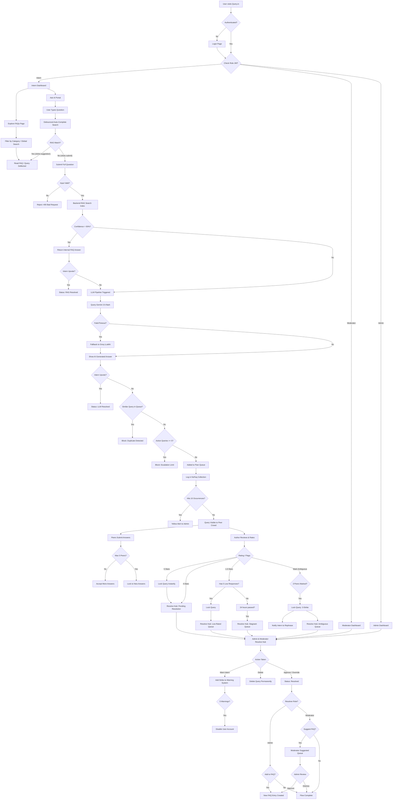

# Query.in — Product Documentation

> **Crowd-sourced FAQ Generation & Peer-to-Peer Query Resolution Platform**

---

## Table of Contents

1. [Executive Summary](#1-executive-summary)
2. [Problem Statement & Motivation](#2-problem-statement--motivation)
3. [Vision, Objectives & Core Value Proposition](#3-vision-objectives--core-value-proposition)
4. [Target Users & Personas](#4-target-users--personas)
5. [Technology Stack](#5-technology-stack)
6. [System Architecture](#6-system-architecture)
7. [Core Workflow — The Query Lifecycle](#7-core-workflow--the-query-lifecycle)
8. [Feature Catalogue](#8-feature-catalogue)
9. [Role-Based Dashboards & Pages](#9-role-based-dashboards--pages)
10. [Database Schema](#10-database-schema)
11. [REST API Reference](#11-rest-api-reference)
12. [Real-Time Engine (Socket.IO)](#12-real-time-engine-socketio)
13. [LLM Pipeline — Multi-Provider AI](#13-llm-pipeline--multi-provider-ai)
14. [Analytics & Metrics](#14-analytics--metrics)
15. [Design System & UI/UX](#15-design-system--uiux)
16. [Security, Access Control & Spam Prevention](#16-security-access-control--spam-prevention)
17. [Edge Cases & Exception Handling](#17-edge-cases--exception-handling)
18. [Configuration & Constants](#18-configuration--constants)
19. [Setup & Deployment](#19-setup--deployment)
20. [Development History & Resolved Issues](#20-development-history--resolved-issues)
21. [Current Implementation Status](#21-current-implementation-status)
22. [Future Roadmap](#22-future-roadmap)
23. [Known Limitations & Open Questions](#23-known-limitations--open-questions)

---

## 1. Executive Summary

**Query.in** is a full-stack MERN platform built for large-scale internship environments where interns regularly ask questions that fall outside the existing knowledge base. Rather than funnelling every question to an overloaded admin, the platform implements a **crowd-sourced, peer-to-peer resolution pipeline** backed by AI.

The system works as follows:

1. An intern types a question → the system tries to answer it instantly via **RAG-based FAQ matching**.
2. If the FAQ doesn't help → a **multi-model LLM pipeline** (Gemini + Groq, 11 models total) synthesises an answer.
3. If the LLM answer isn't satisfactory → the question **escalates to a peer queue** where other interns answer it.
4. Peer answers are **rated by the question author**, and the best ones are **reviewed and approved by admins/moderators**.
5. Approved answers can be **promoted to permanent FAQ entries**, organically growing the knowledge base.

Every state change broadcasts instantly via **Socket.IO** — dashboards, queues, notifications, and FAQs update in real-time without page refreshes.

| Attribute | Value |
|-----------|-------|
| **Stack** | MongoDB Atlas, Express.js, React 18 (Vite), Node.js, Tailwind CSS, Socket.IO 4.x |
| **AI** | Google Gemini API (5 models) + Groq API (6 models) with automatic fallback |
| **Auth** | JWT with bcrypt password hashing |
| **Roles** | Admin, Moderator, Intern |
| **Real-Time** | 100% synchronised via Socket.IO — zero manual refreshes |

---

## 2. Problem Statement & Motivation

### The Problems

| # | Problem | Impact |
|---|---------|--------|
| 1 | **Query Repetition** | Multiple interns ask the same questions repeatedly. Redundant effort, wasted LLM calls, knowledge base underutilised. |
| 2 | **Delay in Answers** | Interns wait extended periods. If FAQ misses, they wait for LLM; if LLM fails, they wait for peers; if peers don't answer, they wait indefinitely. |
| 3 | **Admin Overload** | With hundreds of interns and thousands of queries, a single admin becomes the bottleneck. Slow resolution, burnout, systemic inefficiency. |
| 4 | **Ambiguous & Low-Quality Queries** | Unclear questions waste peer time. Low-quality answers pollute the system. No quality-control mechanism. |

### The Crowd-Sourced Solutions

| Problem | Solution |
|---------|----------|
| Query Repetition | RAG auto-complete, 125+ seed FAQs, NoFaq tracking (10-occurrence alert) |
| Delay in Answers | Multi-provider LLM fallback (11 models) + peer queue (any intern can answer) |
| Admin Overload | Peer rating system, 24-hour sweeper automation, 6-section Resolve Hub |
| Ambiguous Queries | Input sanity validation, 3-strike ambiguous rule, peer quality flagging |

### Traditional vs. Query.in

| Traditional Approach | Query.in Crowd-Sourced Approach |
|---------------------|--------------------------------|
| Admin answers all queries | Interns answer each other's questions |
| Knowledge siloed with experts | Knowledge distributed across community |
| Slow response times | Fast peer answers from those who know |
| Admin burnout | Workload shared across all interns |
| Static FAQ updates | Dynamic FAQ expansion from resolved queries |
| Single point of failure | Multiple peers can answer same query |

---

## 3. Vision, Objectives & Core Value Proposition

### Vision
Transform organisational knowledge management from a top-down, admin-bottlenecked process into a self-sustaining, crowd-sourced ecosystem where the knowledge base grows organically from real user interactions.

### Objectives
1. **Deflect >80% of queries** before they reach a human — via auto-complete, RAG, and LLM.
2. **Reduce admin workload** by having peers do initial answering; admin only reviews and approves.
3. **Build a self-growing FAQ database** — every resolved query is a potential new FAQ entry.
4. **Maintain quality** through structured rating, ambiguity detection, and warning systems.
5. **Deliver real-time experience** — every action instantly visible to all relevant users.

### Core Value Proposition
> "Every question asked makes the system smarter. Every answer given grows the knowledge base. The crowd does the work; the admin validates."

---

## 4. Target Users & Personas

### Intern (Primary User)
- **Who:** New joiners in an internship programme.
- **Goal:** Get quick, accurate answers to work-related questions.
- **Actions:** Ask questions via AI portal, browse FAQs, answer peer queries in the queue, rate peer answers, view announcements.
- **Constraints:** Max 5 unresolved queries at a time. Can be warned/disabled for misuse.

### Moderator (Quality Controller)
- **Who:** Senior staff or experienced interns elevated to review roles.
- **Goal:** Ensure peer answers are accurate before they become official.
- **Actions:** Review escalated queries, approve peer answers or provide overrides, suggest queries for FAQ promotion, view announcements.
- **Constraints:** Cannot create announcements or manage users. Can only suggest FAQs (admin creates them).

### Admin (Final Authority)
- **Who:** System administrator or programme manager.
- **Goal:** Maintain system quality, manage users, grow the knowledge base.
- **Actions:** All moderator actions, plus: create announcements, manage users (register/edit/deactivate/delete), edit FAQs, create FAQs from resolved queries, view analytics, issue warnings.
- **Constraints:** Cannot toggle their own active status or edit/delete their own account. Only one admin exists per application.

### Role Distribution in the Crowd

```
INTERN (Asker)
├─ Submits query
├─ Rates peer answers (1-5 stars)
└─ Receives notifications

INTERN (Peer Answerer) — THE CROWD
├─ Views Peer Queue
├─ Submits answers (max 5 per query)
├─ Can skip queries (no penalty, persisted)
└─ Can mark queries as ambiguous

MODERATOR (Quality Controller)
├─ Reviews escalated queries
├─ Approves peer answers / provides overrides
└─ Suggests archived queries for FAQ database

ADMIN (Final Authority)
├─ Creates FAQs from resolved queries
├─ Reviews all queue sections (6 sections)
├─ Manages users & warnings
└─ Broadcasts announcements
```

---

## 5. Technology Stack

| Layer | Technology | Version |
|-------|------------|---------|
| **Frontend** | React, Vite, Tailwind CSS, React Router | 18, 5.x, 3.4, 7 |
| **Backend** | Node.js, Express | 18+, 5 |
| **Database** | MongoDB Atlas, Mongoose ODM | 9, 9 |
| **Real-time** | Socket.IO | 4.8 |
| **AI — Primary** | Google Gemini API | 3.5-flash (default) |
| **AI — Fallback** | Groq API (LLaMA, Qwen, GPT-OSS) | Free tier |
| **Auth** | JWT, bcrypt | — |
| **Charts** | Recharts | — |
| **Markdown** | react-markdown | — |
| **Cron** | node-cron | — |

---

## 6. System Architecture

### High-Level Architecture Diagram

```
┌─────────────────────────────────────────────────────────────────┐
│                       CLIENT (Browser)                          │
│                    React 18 + Vite + Tailwind                   │
└─────────────────────────────────────────────────────────────────┘
                                │
                  ┌─────────────┼─────────────┐
                  │             │             │
             HTTP/REST     Socket.IO     WebSocket
                  │             │             │
                  ▼             ▼             ▼
┌─────────────────────────────────────────────────────────────────┐
│                  SERVER (Node.js + Express)                      │
│                                                                  │
│  ┌──────────┐ ┌──────────┐ ┌──────────┐ ┌──────────┐           │
│  │   Auth   │ │   FAQ    │ │  Ask AI  │ │   Peer   │           │
│  │  Routes  │ │  Routes  │ │  Routes  │ │  Routes  │           │
│  └────┬─────┘ └────┬─────┘ └────┬─────┘ └────┬─────┘           │
│       └─────────────┴────────────┴─────────────┘                │
│                         │                                        │
│              ┌──────────┴──────────┐                             │
│              │  Controllers Layer  │                             │
│              │  (11 controllers)   │                             │
│              └──────────┬──────────┘                             │
│                         │                                        │
│           ┌─────────────┴─────────────┐                          │
│           │                           │                          │
│  ┌────────┴────────┐      ┌──────────┴──────────┐               │
│  │  grokService.js │      │    sweeper.js        │               │
│  │ (Gemini + Groq) │      │ (15-min cron job)    │               │
│  └─────────────────┘      └─────────────────────┘               │
└─────────────────────────────────────────────────────────────────┘
                                │
                          Mongoose ODM
                                │
┌─────────────────────────────────────────────────────────────────┐
│                     MongoDB Atlas Cluster                        │
│                                                                  │
│  ┌──────┐ ┌──────┐ ┌────────┐ ┌─────┐ ┌───────┐ ┌────────────┐│
│  │ User │ │Query │ │Response│ │ FAQ │ │ NoFaq │ │Announcement││
│  └──────┘ └──────┘ └────────┘ └─────┘ └───────┘ └────────────┘│
│  ┌────────────┐ ┌─────────────────────┐ ┌────────────────────┐  │
│  │Notification│ │ModeratorFaqSuggestion│ │SimilarQueryInterest│  │
│  └────────────┘ └─────────────────────┘ └────────────────────┘  │
└─────────────────────────────────────────────────────────────────┘
```

### Frontend Architecture

```
frontend/src/
├── components/           # Reusable UI components
│   ├── Badge.jsx         # Status indicators
│   ├── Button.jsx        # Primary/secondary actions
│   ├── Card.jsx          # Content containers
│   ├── ConfirmModal.jsx  # Confirmation dialogs for high-impact actions
│   ├── DashboardLayout.jsx # Sticky header + sidebar navigation
│   ├── FormattedAnswer.jsx # AI response rendering
│   ├── NotificationBell.jsx # Bell icon with unread count
│   ├── ProtectedRoute.jsx # Route guards
│   ├── RollingCounter.jsx # Odometer-style animated numbers
│   └── Toast.jsx         # Slide-in notifications (5s auto-dismiss)
├── context/
│   ├── AuthContext.jsx   # JWT token & user state management
│   └── NotificationContext.jsx # Socket.IO client + notification state
├── pages/
│   ├── Landing.jsx       # Public landing page with embedded login
│   ├── FAQs.jsx          # Public FAQ accordion view
│   ├── admin/            # Admin-only pages
│   ├── moderator/        # Moderator-only pages
│   └── intern/           # Intern-only pages
├── utils/
│   ├── api.js            # Protected axios instance (auto JWT header)
│   ├── publicApi.js      # Public axios instance (no auth)
│   ├── navConfig.jsx     # Centralised navigation items for all roles
│   └── dateFormat.js     # Date/time formatting utilities
├── App.jsx               # Router configuration
├── main.jsx              # Entry point
└── index.css             # Global styles
```

### Backend Architecture

```
backend/
├── config/
│   ├── db.js              # MongoDB Atlas connection
│   └── socket.js          # Socket.IO initialisation with JWT auth
├── controllers/           # 11 request handlers
│   ├── authController.js, faqController.js, queryController.js
│   ├── askAIController.js, peerController.js, ratingController.js
│   ├── adminController.js, announcementController.js
│   ├── analyticsController.js, notificationController.js
├── jobs/
│   └── sweeper.js         # 24-hour SLA enforcement cron (runs every 15 min)
├── middleware/
│   └── authMiddleware.js  # protect, authorizeRoles, is_disabled/isActive checks
├── models/                # 9 Mongoose schemas
├── routes/                # Express routers
├── services/
│   └── grokService.js     # Multi-provider LLM service (Gemini + Groq)
├── seeds/
│   └── seed.js            # Database seeding with demo data
└── server.js              # Entry point
```

---

## 7. Core Workflow — The Query Lifecycle

### Step-by-Step Flow

```
STEP 0: AUTO-COMPLETE (as user types)
│
├─ User types in AskAI textarea
├─ Debounce 300ms → GET /api/ask/autocomplete?q=...
├─ RAG keyword search on FAQ keywords, tags, search_text
├─ Returns up to 5 matching FAQs
└─ User selects → instant resolution (type: AUTO_COMPLETE)

STEP 1: RAG SEARCH (on submit)
│
├─ User submits full question → POST /api/ask
├─ Input sanity validation (garbage detection, length checks)
├─ RAG keyword matching on search_text, tags, keywords
├─ Match confidence > 50%?
│   ├─ YES → Return FAQ answer for upvote/downvote
│   │       ├─ UPVOTE → RAG_RESOLVED, query ends
│   │       └─ DOWNVOTE → RAG_DOWNVOTED, go to STEP 2
│   └─ NO → go to STEP 2

STEP 2: LLM FALLBACK (Gemini → Groq)
│
├─ Gemini 3.5-flash → synthesise answer from matching FAQ context
├─ If fails → try next model (5 Gemini, then 6 Groq models)
├─ LLM returns answer → user sees answer with upvote/downvote
│   ├─ UPVOTE → LLM_RESOLVED, query ends
│   └─ DOWNVOTE → LLM_DOWNVOTED, go to STEP 3

STEP 3: PEER ESCALATION
│
├─ Check for previously resolved similar queries
│   └─ Found? → Return historical answer (source: 'previously_resolved')
├─ Check active query cap (max 5 unresolved per intern)
│   └─ Exceeded? → CAP_BLOCKED error
├─ Check for similar pending queries (spam prevention)
│   └─ Found? → SPAM_BLOCKED, track in SimilarQueryInterest
├─ Create Query document (status: 'Pending')
├─ Track in NoFaq collection (for FAQ gap detection)
└─ Query enters Peer Queue

STEP 4: PEER ANSWERS (max 5 peers)
│
├─ Other interns see query in Peer Queue
├─ Intern submits answer → atomic findOneAndUpdate with $expr
├─ Status changes: 'Pending' → 'Peer Answered'
├─ Notification sent to query author
└─ Query author rates each response (1-5 stars)

STEP 5: RATING & LOCKING
│
├─ 5 stars → Query immediately locked → Pending Resolution queue
├─ 4 stars → Query enters Pending Resolution queue (NOT locked)
├─ 1-3 stars + 5 responses all low → Query locked → Low-Rated queue
├─ 1-3 stars + <5 responses + 24h elapsed → Sweeper locks → Stagnant queue
└─ 3 peers mark "Ambiguous" → 3-strike rule → Query locked → Ambiguous queue
    └─ Intern notified: "Your query was unclear. Please rephrase."

STEP 6: ADMIN RESOLUTION
│
├─ Admin/Moderator views Resolve Hub (6 sections)
├─ Actions: Approve peer response, Override with own answer, Warn intern, Delete
└─ Notification sent to intern (query_resolved)

STEP 7: FAQ CREATION (Terminal State)
│
├─ Admin: "Add to FAQ Database" → full modal (category, tags, keywords, priority)
├─ Moderator: "Suggest for FAQ Database" → admin reviews in Moderator Suggested queue
└─ Knowledge base grows organically from real questions
```

### End-to-End Flowchart (Mermaid)



### Query State Machine

```
                     ┌─────────────┐
                     │   PENDING   │ ← Initial state after LLM downvote
                     └──────┬──────┘
                            │
              ┌─────────────┼─────────────┐
              │             │             │
              ▼             ▼             ▼
       ┌───────────┐ ┌───────────┐ ┌───────────┐
       │  3-STRIKE  │ │   PEER    │ │   24HR    │
       │  AMBIGUOUS │ │  ANSWERED │ │  SWEEPER  │
       └─────┬─────┘ └─────┬─────┘ └─────┬─────┘
             │             │             │
             ▼             ▼             ▼
       ┌──────────┐  ┌───────────┐  ┌────────────┐
       │AMBIGUOUS │  │ LOCK or   │  │ STAGNANT   │
       │(terminal)│  │ RATE      │  │ (0 answers)│
       └──────────┘  └─────┬─────┘  └──────┬─────┘
                           │               │
                     ┌─────┴─────┐         │
                     │           │         │
                     ▼           ▼         ▼
               HIGH-RATED   LOW-RATED   is_locked
                 QUEUE        QUEUE      true
                     │           │         │
                     └─────┬─────┴─────────┘
                           │
                           ▼
                  ┌─────────────────┐
                  │ ADMIN RESOLUTION│
                  │(approve/override)│
                  └────────┬────────┘
                           │
                           ▼
                     ┌──────────┐
                     │ RESOLVED │ ← Terminal state
                     └──────────┘
```

---

## 8. Feature Catalogue

### Flagship Features

#### 1. Multi-Provider LLM Pipeline (Gemini + Groq Fallback)
- 11 models across two providers with automatic cascade fallback.
- Temperature 0.1 for focused, deterministic responses.
- Max 2000 output tokens. 60-second timeout per request.
- Plain text only — no emojis, no markdown formatting in responses.
- Accurate model tracking for analytics (returns `{ answer, model }`).

#### 2. 5-Answer Peer Concurrency Lock
- Each query accepts maximum 5 peer responses.
- **Atomic concurrency control:** `findOneAndUpdate` with `$expr: { $lt: [{ $size: "$responses" }, 5] }` prevents race conditions.
- Once 5 responses are reached, the query is locked and escalated.

#### 3. 3-Strike Ambiguous Rule
- 3 different peers marking a query as "ambiguous" triggers automatic lock.
- Anti-gaming: `ambiguous_marked_by` array prevents same peer from marking twice.
- Intern is notified to rephrase and resubmit.
- Admin sees query in Ambiguous Queue for override resolution.

#### 4. 24-Hour Sweeper Automation
- Cron job runs every 15 minutes to enforce SLA timeouts.
- **Stagnant:** 0 responses for 24+ hours → locked, moved to Stagnant Queue.
- **Low-Rated Partial:** 1-4 responses (all 1-3 stars) for 24+ hours → locked, moved to Low-Rated Queue.
- Uses aggregation pipeline + `updateMany` for bulk operations (no N+1 queries).

#### 5. 100% Real-Time Synchronisation
- Single shared Socket.IO connection via global `NotificationContext`.
- Dynamic dashboards, live announcements, instant FAQs, query state sync.
- All pages listen for relevant socket events and update in-place without refresh.

#### 6. FAQ Creation Bridge
- Admin can create FAQ from any resolved query via full modal form (category, tags, keywords, priority).
- Moderators can suggest archived queries for FAQ promotion → admin reviews.
- Knowledge base grows organically from real user questions.

#### 7. Previously Resolved Query Detection
- Before creating a new escalation, system checks for similar resolved queries.
- If found, returns historical approved answer (source: `previously_resolved`).
- Avoids redundant peer escalation.

#### 8. Similar Query Interest Tracking
- When Intern A's query is blocked as similar to Intern B's pending query, Intern A is tracked.
- When Intern B's query is resolved, Intern A gets notified and receives a "shadow query" in their My Escalations.

#### 9. Automated AI FAQ Suggestion Engine
- Queries failing both RAG and LLM are tracked in `NoFaq` collection.
- When a topic hits 10 occurrences → Yellow Alert triggered to all admins.
- `impactedInterns` array prevents count inflation by same intern.

### Supporting Features

| Feature | Description |
|---------|-------------|
| **Query Input Sanity Check** | Frontend + backend validation: min 4 letters, special char ratio <30%, no repeated garbage, unique letter requirements. Error code: `INVALID_QUERY`. |
| **Warning & Credibility System** | Warning count per user (0-5). Auto-disable at 5. Login blocked for disabled/inactive users. Warning banner on MyEscalations. |
| **Priority Announcements** | Admin broadcasts with High (red), Medium (yellow), Low (green) priority levels. |
| **Persistent Skip** | Skipped queries saved to `skipped_by` array. Persist across sessions and page refreshes. |
| **Intern Escalation Deletion** | Interns can delete their own Pending/Peer Answered escalations. Cascading deletion of Response, SimilarQueryInterest, and Notification records. |
| **Confirmation Modals** | High-impact actions (deactivate user, remove user, escalate query, remove warnings) require explicit confirmation via animated modal. |
| **RollingCounter Animation** | Odometer-style animated numbers on all dashboard stat cards. |
| **FAQ Deep Linking** | Popular FAQs link directly to specific FAQ entry with scroll-to-highlight. |
| **Markdown FAQ Rendering** | FAQ answers support markdown (bold, lists, highlights) via react-markdown. |
| **Database Seeding** | `npm run seed` populates realistic demo data (users, queries, responses, announcements). Preserves FAQs collection. |

### Feature Control Matrix

| Feature | Intern | Moderator | Admin |
|---------|--------|-----------|-------|
| Ask AI (RAG + LLM) | ✅ | ✅ | ✅ |
| View FAQs | ✅ | ✅ | ✅ |
| Submit Peer Answer | ✅ | ✅ | ✅ |
| Rate Responses | ✅ | ❌ | ❌ |
| Skip / Mark Ambiguous | ✅ | ❌ | ❌ |
| Delete Own Escalation | ✅ | ❌ | ❌ |
| View Peer Queue | ✅ | ✅ | ✅ |
| Approve Responses | ❌ | ✅ | ✅ |
| Override with Own Answer | ❌ | ✅ | ✅ |
| Suggest FAQ (from Archive) | ❌ | ✅ | ❌ |
| User Registration | ❌ | ❌ | ✅ |
| Bulk CSV Upload | ❌ | ❌ | ✅ |
| Broadcast Announcement | ❌ | ❌ | ✅ |
| User Management | ❌ | ❌ | ✅ |
| Edit/Delete Users | ❌ | ❌ | ✅ |
| Toggle User Active/Inactive | ❌ | ❌ | ✅ |
| Send Warnings | ❌ | ✅ | ✅ |
| FAQ CRUD | ❌ | ❌ | ✅ |
| Create FAQ from Query | ❌ | ❌ | ✅ |
| View Analytics | ❌ | ❌ | ✅ |
| Clear All Data | ❌ | ❌ | ✅ |

---

## 9. Role-Based Dashboards & Pages

### Admin Dashboard

| Page | Route | Purpose |
|------|-------|---------|
| Dashboard | `/admin` | Overview with 5 clickable navigation cards + animated stat cards (Total Users → `/admin/users`, Pending/Resolved → `/admin/resolve`, Announcements → `/admin/announcement`) |
| User Management | `/admin/users` | Combined: Registration accordion (Single + Bulk CSV), User table with Edit/Remove/Activate/Remove Warnings actions, color-coded warning badges |
| Announcements | `/admin/announcement` | Publish announcements with priority selector, total count display |
| FAQ Editor | `/admin/faqs` | Full CRUD on FAQ collection with search bar and dynamic category dropdown |
| Query Management | `/admin/resolve` | 6-section Resolve Hub (see below) |
| Analytics | `/admin/analytics` | Interactive Recharts visualisations: AI performance, bottleneck analysis, resolution distribution, daily trends, human intervention metrics |

### 6-Section Admin Resolve Hub

| Section | Filter Condition | Response Display |
|---------|-----------------|------------------|
| **Pending Resolution** | Queries with any response rated ≥4 stars, excludes Ambiguous/Resolved | Only 4-5★ responses shown, sorted 5★ first |
| **Ambiguous Queries** | status = 'Ambiguous' (3-strike triggered) | All responses shown. Delete button available. |
| **Stagnant (Locked, 24h+)** | 0-4 responses (all 1-3★), created 24+ hours ago | All responses shown (sorted 3★→1★) |
| **Low-Rated** | 5+ responses, ALL rated < 4 stars | All responses shown (sorted 3★→1★), Approve button on each |
| **Archive** | status = 'Resolved' | Only approved (approval=true) response shown. Resolver info displayed. |
| **Moderator Suggested** | Pending FAQ suggestions from moderators | Question + answer, "Add to FAQ" or "Dismiss" buttons. Shows moderator email. |

### Moderator Dashboard

| Page | Route | Purpose |
|------|-------|---------|
| Dashboard | `/moderator` | Overview with clickable stat cards |
| Announcements | `/moderator/announcements` | View admin broadcasts with priority indicators |
| Query Management | `/moderator/resolve` | 4-section queue (Pending Resolution, Stagnant, Low-Rated, Archive with "Suggest for FAQ" button) |
| All Notifications | `/moderator/notifications` | Full notifications list (accessible via bell icon) |

### Intern Dashboard

| Page | Route | Purpose |
|------|-------|---------|
| Dashboard | `/intern` | Overview with animated stat cards (Active Queries, Peer Responses, Resolved → linked to My Escalations) |
| Ask AI | `/intern/ask` | Textarea input (Shift+Enter for newline, Enter to submit), auto-complete chips, RAG/LLM/escalation flow |
| Peer Queue | `/intern/peer-queue` | Card-by-card view of other interns' pending questions. Skip/Answer/Mark Ambiguous actions. |
| My Escalations | `/intern/my-queries` | Track own queries, rate peer responses, view resolution status. Warning banner if user has warnings. Delete own pending escalations. |
| View FAQs | `/intern/faqs` | Accordion FAQ browser with category filters and search |
| Announcements | `/intern/announcements` | Real-time announcements with priority badges and timestamps |

---

## 10. Database Schema

**MongoDB Atlas cluster with 9 collections. Mongoose ODM for schema validation.**

### Users
```javascript
{
  _id: ObjectId,
  email: String,           // Unique, lowercase, validated
  password: String,        // bcrypt hashed (min 6 chars)
  role: String,            // enum: 'admin' | 'moderator' | 'intern'
  warning_count: Number,   // Default: 0, max: 5
  is_disabled: Boolean,    // Default: false, auto-set at warning_count >= 5
  isActive: Boolean,       // Default: true, admin toggle for soft deactivation
  createdAt: Date,
  updatedAt: Date
}
```

### Queries
```javascript
{
  _id: ObjectId,
  intern_id: ObjectId,     // Ref: User (required)
  query_text: String,      // Required, trimmed
  status: String,          // enum: 'Pending' | 'Peer Answered' | 'Ambiguous' | 'Resolved'
  responses: [ObjectId],   // Ref: Response (max 5)
  ambiguous_count: Number, // Default: 0, max: 3
  ambiguous_marked_by: [ObjectId], // Ref: User (unique peers)
  skipped_by: [ObjectId],  // Ref: User (interns who skipped)
  resolved_by: ObjectId,   // Ref: User (nullable)
  resolved_at: Date,
  resolution_type: String, // enum: 'peer_approved' | 'admin_override' | 'moderator_override' | 'auto_ambiguous'
  is_locked: Boolean,      // Default: false
  createdAt: Date, updatedAt: Date
}
```

### Responses
```javascript
{
  _id: ObjectId,
  query_id: ObjectId,      // Ref: Query (required)
  author_id: ObjectId,     // Ref: User (required)
  response_text: String,   // Required
  peer_note: String,       // Optional private note for admins
  response_type: String,   // enum: 'peer' | 'moderator' | 'admin'
  approval: Boolean,       // Default: false
  rating: Number,          // 1-5, nullable until rated
  rater_note: String,      // Optional intern note for admins (max 500 chars)
  createdAt: Date, updatedAt: Date
}
```

**Response Type & Approval States:**

| response_type | approval | Meaning | Badge Display |
|---------------|----------|---------|---------------|
| `peer` | `false` | Peer submitted, awaiting rating | "Peer" |
| `peer` | `true` | Peer response approved by admin/mod | "Admin Approved" / "Moderator Approved" |
| `admin` | `true` | Admin approved a peer response | "Admin Approved" |
| `admin` | `false` | Admin wrote override answer | "Admin Override" |
| `moderator` | `true` | Moderator approved a peer response | "Moderator Approved" |
| `moderator` | `false` | Moderator wrote override answer | "Moderator Override" |

### FAQs
```javascript
{
  _id: ObjectId,
  clean_question: String,  // Required, sanitised
  answer: String,          // Required
  category: String,        // Required
  tags: [String],          // Default: []
  keywords: [String],      // Default: [] (high-weight for autocomplete)
  search_text: String,     // Required (indexed for RAG)
  intent: String,          // User intent classification
  priority: Number,        // Default: 0 (higher = more important)
  related_questions: [String],
  escalate_if_uncertain: Boolean, // Default: false
  createdAt: Date, updatedAt: Date
}
// Indexes: search_text (text), keywords (1), category (1)
// 125 seed FAQs pre-loaded from vins_faq_structured.json
```

### NoFaqs (Content Gap Tracking)
```javascript
{
  _id: ObjectId,
  queryText: String,        // Required, unique
  occurrenceCount: Number,  // Default: 1, min: 1
  impactedInterns: [ObjectId], // Distinct interns (anti-inflation)
  firstLoggedDate: Date,
  lastUpdatedDate: Date
}
// Alert threshold: occurrenceCount >= 10 triggers admin Yellow Alert
```

### Announcements
```javascript
{
  _id: ObjectId,
  admin_id: ObjectId,       // Ref: User (required)
  heading: String,          // Required, max 200 chars
  content: String,          // Required
  priority: String,         // enum: 'low' | 'medium' | 'high', default: 'medium'
  createdAt: Date, updatedAt: Date
}
```

### Notifications
```javascript
{
  _id: ObjectId,
  recipient_id: ObjectId,   // Ref: User
  type: String,             // enum: 'peer_answer' | 'query_resolved' | 'admin_alert' | 'announcement' | 'faq_added' | 'intern_warning'
  title: String,            // max 200 chars
  message: String,          // max 1000 chars
  link_id: ObjectId,        // Ref: Query/FAQ/Announcement (optional)
  link_type: String,        // enum: 'query' | 'faq' | 'announcement'
  is_read: Boolean,         // Default: false
  created_by: ObjectId,     // Ref: User (optional)
  createdAt: Date, updatedAt: Date
}
```

### ModeratorFaqSuggestions
```javascript
{
  _id: ObjectId,
  query_id: ObjectId,       // Ref: Query
  suggested_by: ObjectId,   // Ref: User (moderator)
  question_text: String,
  suggested_answer: String,
  status: String,           // enum: 'pending' | 'approved' | 'dismissed', default: 'pending'
  createdAt: Date, updatedAt: Date
}
```

### SimilarQueryInterests
```javascript
{
  _id: ObjectId,
  original_query_id: ObjectId, // Ref: Query
  interested_intern_id: ObjectId, // Ref: User
  query_text: String,          // Text intern tried to submit
  notified: Boolean,           // Default: false
  createdAt: Date, updatedAt: Date
}
// Shadow queries created for each interested intern when original is resolved
```

### Entity Relationship Summary

```
User ─────────< Query (intern_id)
User ─────────< Response (author_id)
Query ────────< Response (query_id, max 5)
User ─────────< Announcement (admin_id)
User ─────────< Notification (recipient_id)
Query ────────< SimilarQueryInterest (original_query_id)
User ─────────< SimilarQueryInterest (interested_intern_id)
Query ────────< ModeratorFaqSuggestion (query_id)
User ─────────< ModeratorFaqSuggestion (suggested_by)
```

---

## 11. REST API Reference

### Endpoint Index

| Group | Method | Endpoint | Auth | Role |
|-------|--------|----------|------|------|
| **Auth** | POST | `/api/auth/register` | ✅ | Admin |
| | POST | `/api/auth/login` | ❌ | Any |
| | GET | `/api/auth/me` | ✅ | Any |
| | POST | `/api/auth/bulk-register` | ✅ | Admin |
| | GET | `/api/auth/users` | ✅ | Admin |
| | PATCH | `/api/auth/users/:id/toggle-status` | ✅ | Admin |
| | PATCH | `/api/auth/users/:id/remove-warnings` | ✅ | Admin |
| | PATCH | `/api/auth/users/:id` | ✅ | Admin |
| | DELETE | `/api/auth/users/:id` | ✅ | Admin |
| **FAQs** | GET | `/api/faqs` | ❌ | Public |
| | GET | `/api/faqs/categories` | ❌ | Public |
| | GET | `/api/faqs/search?q=` | ❌ | Public |
| | POST | `/api/faqs` | ✅ | Admin |
| | PUT | `/api/faqs/:id` | ✅ | Admin |
| | DELETE | `/api/faqs/:id` | ✅ | Admin |
| **Ask AI** | GET | `/api/ask/autocomplete?q=` | ✅ | Any |
| | POST | `/api/ask` | ✅ | Any |
| **Peer** | GET | `/api/peer/queue` | ✅ | Any |
| | GET | `/api/peer/my-escalations` | ✅ | Any |
| | GET | `/api/peer/stats` | ✅ | Intern |
| | POST | `/api/peer/answer` | ✅ | Any |
| | POST | `/api/peer/skip` | ✅ | Any |
| | POST | `/api/peer/ambiguous` | ✅ | Any |
| | DELETE | `/api/peer/:query_id` | ✅ | Intern (owner) |
| **Ratings** | POST | `/api/ratings/:id` | ✅ | Intern |
| **Admin** | GET | `/api/admin/escalated` | ✅ | Admin/Mod |
| | GET | `/api/admin/query/:id` | ✅ | Admin/Mod |
| | GET | `/api/admin/spoiled-users` | ✅ | Admin |
| | GET | `/api/admin/moderator-suggestions` | ✅ | Admin |
| | POST | `/api/admin/approve` | ✅ | Admin/Mod |
| | POST | `/api/admin/override` | ✅ | Admin/Mod |
| | POST | `/api/admin/create-faq` | ✅ | Admin |
| | POST | `/api/admin/suggest-faq` | ✅ | Moderator |
| | POST | `/api/admin/clear-all-data` | ✅ | Admin |
| | POST | `/api/admin/warn-user` | ✅ | Admin/Mod |
| | PATCH | `/api/admin/moderator-suggestions/:id/dismiss` | ✅ | Admin |
| **Analytics** | GET | `/api/analytics/dashboard` | ✅ | Admin |
| | GET | `/api/analytics/faq-suggestions` | ✅ | Admin |
| | GET | `/api/analytics/no-faq` | ✅ | Admin |
| | GET | `/api/analytics/stats` | ✅ | Admin |
| | DELETE | `/api/analytics/suggestions/:id` | ✅ | Admin |
| | POST | `/api/analytics/create-faq` | ✅ | Admin |
| **Announcements** | GET | `/api/announcements` | ✅ | Any |
| | POST | `/api/announcements` | ✅ | Admin |
| **Notifications** | GET | `/api/notifications` | ✅ | Any |
| | GET | `/api/notifications/unread-count` | ✅ | Any |
| | PATCH | `/api/notifications/:id/read` | ✅ | Any |
| | PATCH | `/api/notifications/read-all` | ✅ | Any |
| | DELETE | `/api/notifications/:id` | ✅ | Any |

### Error Response Format
```json
{
  "success": false,
  "error": "Error message description",
  "code": "ERROR_CODE (optional)"
}
```

| Status | Meaning |
|--------|---------|
| 400 | Bad Request — invalid input |
| 401 | Unauthorised — missing/invalid token |
| 403 | Forbidden — insufficient permissions or account disabled |
| 404 | Not Found |
| 429 | Too Many Requests (query cap) |
| 500 | Server Error |

---

## 12. Real-Time Engine (Socket.IO)

### Authentication Flow
```
Client connects with JWT token
        ↓
Socket middleware extracts token → jwt.verify()
        ↓
Valid? → Join room user:{id}
         Join room room:admins (if admin/moderator)
        ↓
Invalid? → Reject connection
```

### Rooms

| Room | Members | Purpose |
|------|---------|---------|
| `user:{userId}` | Specific user | Personal notifications |
| `room:admins` | Admin + Moderator | Admin/mod broadcasts |
| `query:{queryId}` | Query participants | Query-specific updates |

### Socket Events

| Event | Direction | Payload | Description |
|-------|-----------|---------|-------------|
| `new_notification` | Server → Client | Notification object | Any new notification |
| `new_peer_answer` | Server → Client | `{query_id, query_text, response_id, responder_email}` | Peer submitted answer |
| `query_resolved` | Server → Client | `{query_id, query_text, resolution_type, resolved_by}` | Query resolved or marked ambiguous |
| `yellow_alert` | Server → Admin room | NoFaq threshold data | NoFaq hits 10 occurrences |
| `escalation_deleted` | Server → User + Admin rooms | `{query_id}` | Intern deleted their escalation |
| `faq_updated` | Server → All | FAQ data | FAQ created/updated by admin |
| `faq_deleted` | Server → All | `{faq_id}` | FAQ deleted by admin |

### Pages That Listen for Real-Time Updates

All major pages subscribe to relevant socket events via the shared `NotificationContext`:

- **InternDashboard:** Refreshes stats and popular FAQs on `faq_updated`, `faq_deleted`
- **MyEscalations:** Updates query list on `new_peer_answer`, `query_resolved`, `escalation_deleted`
- **Announcements (all roles):** Prepends new announcements on `new_notification` with type `announcement`
- **PeerQueue:** Refreshes queue on peer-related events
- **Admin/ModeratorResolveHub:** Refreshes query lists on resolution events

---

## 13. LLM Pipeline — Multi-Provider AI

### Model Cascade

**Gemini Models (Primary — Google API):**

| Priority | Model | Use Case |
|----------|-------|----------|
| 1 | `gemini-3.5-flash` | Default — text, multimodal, agentic tasks |
| 2 | `gemini-3.1-pro-preview` | Complex reasoning, advanced coding |
| 3 | `gemini-3.1-flash-lite` | Cost-efficient, high-frequency tasks |
| 4 | `gemini-2.5-flash` | Legacy stable |
| 5 | `gemini-2.5-pro` | Legacy heavy-lifter |

**Groq Models (Fallback — Free Tier):**

| Priority | Model | Use Case |
|----------|-------|----------|
| 1 | `llama-3.3-70b-versatile` | Summarisation, deep reasoning |
| 2 | `llama-3.1-8b-instant` | High-volume, quick chat |
| 3 | `llama-4-scout-17b` | Multimodal (images), 128k context |
| 4 | `qwen3-32b` | Coding, multilingual reasoning |
| 5 | `gpt-oss-120b` | Heavy-duty reasoning |
| 6 | `gpt-oss-20b` | Lighter reasoning tasks |

### Configuration

| Setting | Value |
|---------|-------|
| Max Output Tokens | 2000 |
| Temperature | 0.1 (focused, deterministic) |
| Timeout | 60 seconds |
| Response Format | Plain text only (no emojis, no formatting) |

### Pipeline Logic

1. User submits question → backend validates input (sanity check).
2. RAG search on MongoDB text index (`search_text`, `tags`, `keywords`).
3. If RAG match confidence >50% → return FAQ answer for upvote/downvote.
4. If no match or downvoted → try Gemini models 1-5 in sequence.
5. If all Gemini models fail → try Groq models 1-6 in sequence.
6. If LLM succeeds → return answer for upvote/downvote.
7. If LLM fails or downvoted → check for previously resolved similar queries.
8. If not found → check spam/cap limits → create peer escalation.

### Backend Logging
```
✅ [GEMINI] Model: gemini-3.5-flash | Stage: synthesis
📤 [GEMINI] Model: gemini-3.5-flash | Response length: 1250 chars
⚠️ [GEMINI] Model: gemini-2.5-flash | Synthesis failed: timeout
🔄 All Gemini models failed, trying Groq...
📊 [ANALYTICS] intern:xxx | llm_resolved | {"model":"gemini-3.5-flash","stage":"gemini"}
```

---

## 14. Analytics & Metrics

### Resolution Type Tracking

Every query resolution is categorised for analytics:

| Type | Description | Trigger |
|------|-------------|---------|
| `AUTO_COMPLETE` | Resolved via auto-complete suggestion | User selects suggestion |
| `RAG_RESOLVED` | RAG found answer, user upvoted | User upvotes RAG answer |
| `RAG_DOWNVOTED` | RAG answer downvoted | User downvotes RAG answer |
| `LLM_RESOLVED` | LLM answered, user upvoted | User upvotes LLM answer |
| `LLM_DOWNVOTED` | LLM answer downvoted | User downvotes LLM answer |
| `ESCALATED` | LLM failed, sent to peer queue | All AI attempts fail |
| `SPAM_BLOCKED` | Similar query already in queue | Duplicate detection |
| `CAP_BLOCKED` | 5 active queries reached | Query cap enforcement |
| `PEER_APPROVED` | Peer answer approved by admin/mod | Admin approves |
| `ADMIN_OVERRIDE` | Admin resolved with own answer | Admin overrides |
| `MODERATOR_OVERRIDE` | Moderator resolved with own answer | Moderator overrides |

### Analytics Dashboard Metrics

The admin analytics page (`/admin/analytics`) displays interactive Recharts visualisations:

1. **AI Performance Comparison:**
   - RAG Helpfulness % = RAG Upvotes / (RAG Upvotes + RAG Downvotes)
   - LLM Helpfulness % = LLM Upvotes / (LLM Upvotes + LLM Downvotes)
   - Both rates displayed prominently side-by-side.

2. **Resolution Distribution:** Pie chart showing breakdown across all resolution types with percentages.

3. **Bottleneck Analysis:** Pending vs. resolved queries, resolution rate percentage.

4. **Human Intervention Index:** Admin override count, moderator override count, total interventions as % of all resolutions.

5. **Peer Performance:** Peer-approved counts split by admin vs. moderator approvals.

6. **Daily Trends:** Line chart showing resolution types over time.

---

## 15. Design System & UI/UX

### Colour Palette

| Colour | Hex | Usage |
|--------|-----|-------|
| Background | `#FAFAFA` | Page background |
| Surface | `#FFFFFF` | Card/modal surfaces |
| Black | `#000000` | Primary text, buttons, borders |
| White | `#FFFFFF` | Text on dark backgrounds |
| Highlight | `#FFD000` | Alerts, emphasis, important actions |
| Gold | `#FFD700` | Rating stars |
| Error Red | `#DC2626` | Critical warnings, errors |
| Success Green | `#166534` | Low-priority announcements |

### Typography & Spacing

| Size | Class | Usage |
|------|-------|-------|
| 12px | `text-xs` | Badges, timestamps |
| 14px | `text-sm` | Body text |
| 16px | `text-base` | Emphasis, labels |
| 18px | `text-lg` | Headings |
| 24px | `text-xl` | Page titles |

**Spacing:** 8px rhythm with `py-2`, `py-3`, `py-4`, `space-y-4`, `space-y-6`.

### Component Library

| Component | Styling |
|-----------|---------|
| **Button (Primary)** | `bg-black text-white hover:bg-gray-800 rounded-xl shadow-md border border-black` |
| **Button (Secondary)** | `bg-white text-black border border-black hover:bg-gray-50 rounded-xl shadow-md` |
| **Card** | `bg-white rounded-xl shadow-md border border-black p-4` |
| **Badge** | `text-xs font-medium rounded-full px-2.5 py-1` |
| **Toast** | Slide-in from bottom-right, `shadow-xl`, auto-dismiss 5s |
| **NotificationBell** | Bell icon with unread count badge and dropdown |
| **RollingCounter** | Odometer-style digit animation, smooth ease-out cubic |
| **ConfirmModal** | Smooth animation, used for high-impact actions |

### Design Principles
- **Strict Black & White theme** with strategic colour accents.
- **Rounded-xl corners (16px)** throughout the application.
- **Soft shadows** (`shadow-md` resting, `shadow-xl` hover) with `duration-200` transitions.
- **User select disabled** globally except for input fields (prevents accidental text selection).
- **Sticky sidebar** navigation that persists during content scrolling.
- **Clean header** — no global search bar; notification bell and user badge right-aligned.
- **Hover micro-interactions** — scale, shadow, and background transitions on cards and buttons.

---

## 16. Security, Access Control & Spam Prevention

### Authentication & Authorisation

- **JWT-based authentication** with bcrypt password hashing (min 6 chars).
- **RBAC middleware** (`protect`, `authorizeRoles`) on every protected endpoint.
- **Role hierarchy:** Admin > Moderator > Intern.
- **Token verification** on every Socket.IO connection.
- **Axios interceptors** auto-attach JWT header; 401 responses trigger logout (except `/auth/login`).

### Account Security

- **`protect` middleware** checks `is_disabled` and `isActive` on every API call.
- Disabled users receive 403 → frontend triggers immediate logout.
- Inactive users cannot log in (403: "Your account has been deactivated").
- Admin cannot toggle themselves or other admins.
- Admin cannot edit/delete their own account.
- Only one admin should exist per application (Admin role removed from registration dropdown).

### Warning System

1. Admin/Moderator clicks "Send Warning" in query detail panel.
2. Modal appears with optional warning message.
3. `warnIntern()` increments `warning_count`.
4. If `warning_count >= 5` → `is_disabled = true`, user cannot log in.
5. `intern_warning` notification sent to intern.
6. Admin can reset warnings via "Remove Warnings" (resets count to 0, re-enables account).

**Warning Badge Colours (User Management page):**
- `warning_count === 0`: Green badge
- `warning_count >= 1`: Yellow badge
- `warning_count >= 5`: Red badge

### Spam Prevention

- **Active Query Cap:** Max 5 unresolved queries per intern.
- **Similar Query Detection:** Case-insensitive regex check before escalation.
- **Similar Query Interest Tracking:** Blocked interns are tracked and notified when original resolves.
- **Input Sanity Validation:**
  - Minimum 4 actual letters.
  - Special character ratio < 30%.
  - 3+ consecutive letters required.
  - Repeated pattern detection (blocks `aaa`, `ajflafjllafffaafas`).
  - 4-6 unique letters required (scaled by length).
  - Long strings (>20 chars) must have common words OR 8+ unique letters.
  - Repeated pattern ratio < 40%.
- **Anti-inflation:** `impactedInterns` array in NoFaq prevents same intern from inflating counts.

### Ngrok/CORS Configuration
- Backend CORS configured with `origin: true` to allow ngrok hosts.
- `ngrok-skip-browser-warning: true` header added to axios instances.
- Vite config: `server.allowedHosts: true`.

---

## 17. Edge Cases & Exception Handling

| Edge Case | Handling |
|-----------|---------|
| Race condition in peer answer submission | Atomic `findOneAndUpdate` with `$expr: { $lt: [{ $size: "$responses" }, 5] }` |
| Intern answers own query | Excluded from peer queue via `intern_id` filter |
| Intern already answered this query | Excluded from peer queue via response author check |
| Peer marks ambiguous twice | `$addToSet` on `ambiguous_marked_by` prevents duplicates |
| Intern submits similar query to pending one | Blocked with SPAM_BLOCKED; tracked in SimilarQueryInterest |
| Intern submits similar query to RESOLVED one | Returns previously resolved answer directly |
| Skipped queries reappear after refresh | `skipped_by` array persists skips in database |
| 5-star rating on query with existing responses | Immediate lock regardless of other responses |
| All LLM models fail | Returns error; user can retry or submit differently |
| User disabled mid-session | `protect` middleware checks on every API call; 403 triggers immediate logout |
| Admin tries to toggle own status | Rejected with 400 error |
| Moderator suggestion already pending | Rejected with "already pending review" error |
| Cascading deletion on escalation delete | Removes Query, all Responses, SimilarQueryInterests, and Notifications |
| Notification created after response sent | Moved `await createNotification` before `res.json()` in all controllers |
| WebSocket duplicate connections | Refactored to use single shared socket from `NotificationContext` |
| Stagnant queries with 0 responses | Fixed filter to handle 0-response case alongside 1-4 low-rated responses |
| Login page refreshes on wrong password | 401 interceptor skips redirect when URL contains `/auth/login` |

---

## 18. Configuration & Constants

| Setting | Value |
|---------|-------|
| Backend Port | 5000 |
| Frontend Port | 5173 |
| Database Name | `faq_escalation` |
| Max Output Tokens (LLM) | 2000 |
| LLM Temperature | 0.1 |
| LLM Timeout | 60 seconds |
| Max Unresolved Queries per Intern | 5 |
| Max Peer Responses per Query | 5 |
| Ambiguous Strike Threshold | 3 |
| FAQ Suggestion Alert Threshold | 10 occurrences |
| Auto-complete Debounce | 300ms |
| Toast Auto-dismiss | 5 seconds |
| Sweeper Interval | 15 minutes |
| SLA Timeout | 24 hours |
| Rating Lock Threshold (immediate) | 5 stars |
| Rating High Threshold (queue) | 4 stars |
| Max Warning Count | 5 (auto-disable) |

### Environment Variables

**Backend (.env):**
```env
PORT=5000
NODE_ENV=development
MONGO_URI=mongodb+srv://<user>:<pass>@<cluster>.mongodb.net/faq_escalation
JWT_SECRET=your-secret-key
GEMINI_API_KEY=your-gemini-api-key
GROQ_API_KEY=your-groq-api-key
CLIENT_URL=http://localhost:5173
```

**Frontend (.env):**
```env
VITE_API_URL=http://localhost:5000/api
```

---

## 19. Setup & Deployment

### Prerequisites
- Node.js v18+, npm v8+
- MongoDB Atlas account (or local MongoDB)
- Google Gemini API key
- Groq API key (free tier)

### Quick Start
```bash
# Backend
cd backend
npm install
# Create .env file (see Configuration section)
npm run dev
# Expected: 🚀 Query.in server running on port 5000

# Frontend (new terminal)
cd frontend
npm install
# Create .env file
npm run dev
# Expected: VITE ready at http://localhost:5173
```

### Database Seeding
```bash
cd backend
npm run seed
# WARNING: Deletes all data except FAQs collection
```

### Test Accounts

| Role | Email | Password |
|------|-------|----------|
| Admin | admin@query.in | Admin1@123 |
| Moderator | mod1@query.in | Mod1@123 |
| Moderator | mod2@query.in | Mod2@123 |
| Intern | intern1@query.in — intern10@query.in | Intern1@123 — Intern10@123 |

### Internet Testing (Ngrok)
```bash
# Terminal 1: Backend tunnel
ngrok http 5000
# Update frontend .env with backend ngrok URL

# Terminal 2: Frontend tunnel
ngrok http 5173
# Share frontend ngrok URL with testers
```

---

## 20. Development History & Resolved Issues

The project has gone through **15 development phases** and **134+ bug fixes**. Below is a summary of the major milestones and categories of issues resolved:

### Development Phases

| Phase | Status | Description |
|-------|--------|-------------|
| 1 | ✅ | Project Architecture & Planning |
| 2 | ✅ | MERN Stack Setup & Foundation |
| 3 | ✅ | Database & Backend APIs |
| 4 | ✅ | Authentication & RBAC |
| 5 | ✅ | Admin, Moderator & Intern Dashboards |
| 6 | ✅ | RAG & LLM Integration |
| 7 | ✅ | Peer Escalation Workflow Engine |
| 8 | ✅ | AI FAQ Suggestion Engine |
| 9 | ✅ | Realtime Notifications & Queue System |
| 10 | ⬜ | Automated Testing Suite (Pending) |
| 11 | ✅ | Documentation Engine |
| 12 | ✅ | Notification System |
| 13 | ✅ | Backend Performance & Correctness Fixes |
| 14 | ✅ | UI/UX Modernisation |
| 15 | ✅ | QA, Bug Fixes, and Demo Data Seeding |

### Key Bug Fix Categories (134 issues resolved)

**Infrastructure & API Fixes (Issues 1-19):**
- MongoDB connection, deprecated options, missing routes, import errors.
- Peer answer submission failures (req.user.id vs req.user.userId).
- RAG downvote logic, LLM upvote handling, garbage input validation.

**Concurrency & Performance (Issues 27-28):**
- **Race condition** in peer answer submission → atomic `findOneAndUpdate` with `$expr`.
- **N+1 query** in sweeper → aggregation pipeline + `updateMany`.

**Workflow & Business Logic (Issues 34-45, 62-69, 88-98):**
- Peer queue visibility rules, rating lock logic, ambiguous notification flow.
- Admin resolve hub section filtering, archive display, FAQ creation from query.
- Moderator suggestion workflow, moderator suggested queue lifecycle.
- Escalation deletion with cascading cleanup.

**Real-Time & Socket.IO (Issues 109-111):**
- Shared socket from `NotificationContext` (eliminated duplicate connections).
- Real-time page content updates (not just toast notifications).
- FAQ update propagation to intern dashboards.

**UI/UX Polish (Issues 50-61, 112-134):**
- Dashboard stats accuracy, input textarea UX, icon fixes, hover effects.
- Analytics chart sizing, percentage tooltips, odometer animations.
- Header layout, sidebar scroll behaviour, stat card navigation links.
- Confirmation modals for high-impact actions.

---

## 21. Current Implementation Status

### ✅ Fully Implemented
- Multi-provider LLM pipeline (Gemini + Groq, 11 models)
- RAG-based FAQ search with auto-complete
- Peer escalation queue with 5-answer concurrency lock
- 3-strike ambiguous rule with intern notification
- 24-hour sweeper automation
- 6-section Admin Resolve Hub
- 4-section Moderator Resolve Hub
- Rating system with lock triggers
- Warning & credibility system (0-5 warnings, auto-disable)
- Real-time Socket.IO synchronisation across all pages
- JWT authentication with RBAC
- Notification system (hybrid real-time + persistent)
- Analytics dashboard with interactive charts
- Database seeding with demo data
- Moderator FAQ suggestion workflow
- Previously resolved query detection
- Similar query interest tracking with shadow queries
- Intern escalation deletion with cascading cleanup
- Bulk CSV user upload
- Priority announcements (high/medium/low)
- Full documentation suite

### ⬜ Not Implemented
- Automated testing suite (Phase 10 — planned but not started)
- Production deployment optimisation
- Performance tuning for large FAQ collections (1000+ entries)

---

## 22. Future Roadmap

### Planned Features

1. **Gamification System**
   - Points for helpful peer answers.
   - Badges for quality contributors.
   - Leaderboard for top peers.

2. **Peer Mentorship**
   - Link senior interns with junior interns.
   - Topic-based expertise matching.

3. **Community Voting**
   - Upvote/downvote peer answers beyond the original author.
   - Sort by community approval.

4. **Expert Verification**
   - Mark certain interns as topic experts.
   - "Expert Answered" badge on responses.

5. **FAQ Versioning**
   - Community-suggested FAQ improvements.
   - Track FAQ evolution over time.

6. **Automated Testing Suite**
   - Unit tests for all controllers.
   - Integration tests for the full query lifecycle.
   - End-to-end tests for critical user flows.

---

## 23. Known Limitations & Open Questions

### Known Limitations

| Limitation | Details |
|-----------|---------|
| **Single Admin** | System assumes exactly one admin. Role dropdown excludes Admin. |
| **No Pagination on Peer Queue** | All available queries loaded at once. May not scale beyond hundreds of concurrent queries. |
| **LLM Rate Limits** | Groq free tier has strict rate limits. No built-in retry backoff for rate-limited responses. |
| **No Email Verification** | User registration doesn't verify email addresses. |
| **No Password Reset** | No forgot-password or password-change flow. |
| **No Image/File Uploads** | Queries are text-only. No attachment support. |
| **Regex-based Similarity** | Similar query detection uses case-insensitive regex, not semantic similarity. May miss semantically similar but differently worded queries. |
| **No Offline Support** | Application requires active internet connection. No service worker or PWA capabilities. |
| **No Audit Trail** | No logging of who changed what and when for admin actions (beyond resolution tracking). |

### Open Questions

1. **Scaling:** How will the system perform with 500+ concurrent interns and 10,000+ queries? (Untested at scale.)
2. **FAQ Quality Control:** Currently no mechanism for interns to report incorrect FAQs.
3. **LLM Cost Management:** No budget tracking or cost alerting for Gemini API usage.
4. **Data Retention:** No policy for archiving old queries or purging stale data.
5. **Accessibility:** No formal accessibility audit (WCAG compliance) has been performed.

---

*This document was last updated on 9 June 2026 and represents the complete, authoritative specification of the Query.in platform.*
