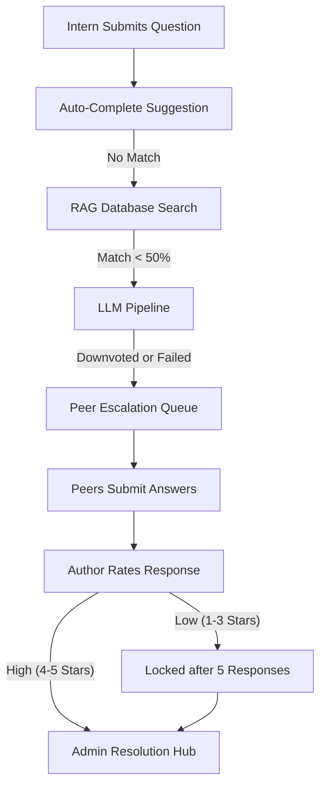

# Query.in - Product Documentation

> **Crowd-sourced FAQ Generation & P2P Query Resolution Platform**

**Query.in** is a comprehensive MERN stack platform designed for large-scale internship environments where interns ask questions that cannot be answered by the existing knowledge base. Questions intelligently escalate through a peer-review pipeline, get rated by authors, and ultimately get resolved by moderators or admins, turning organizational knowledge gaps into permanent FAQ entries.

## 1. Project Overview & Architecture

| Attribute | Value |
|-----------|-------|
| **Stack** | MongoDB, Express.js, React (Vite), Node.js, Tailwind CSS, Socket.IO |
| **AI Integration**| Multi-provider LLM pipeline (Gemini + Groq APIs) |
| **Design System** | Strict Black (#000000) & White (#FFFFFF) theme with Yellow (#FFD000) highlights, Gold (#FFD700) for rating stars, Red (#DC2626) for warnings. Modern SaaS aesthetic with rounded-xl corners (16px) and soft shadows. |
| **Auth** | JWT-based with bcrypt password hashing |
| **Roles** | Admin, Moderator, Intern |

### 100% Real-Time Synchronization
The entire platform operates on a shared Socket.IO connection exposed via a global `NotificationContext`, ensuring seamless updates without page refreshes. Dashboards, APIs, queues, announcements, and FAQs update instantly across all connected clients.

## 2. Flagship Features

### Multi-Provider LLM Pipeline (Gemini + Groq Fallback)
The AI resolution system uses a sophisticated multi-model fallback pipeline with a max 2000 output tokens and strict formatting rules (plain text only, no emojis). 
- **Gemini Models (Primary):** 3.5-flash → 3.1-pro → 3.1-flash-lite → 2.5-flash → 2.5-pro
- **Groq Models (Fallback):** llama-3.3-70b → llama-3.1-8b → llama-4-scout → qwen3-32b → gpt-oss-120b → gpt-oss-20b

### Automated AI FAQ Suggestion Engine
Queries that consistently fail both RAG and LLM resolution are tracked in a `NoFaq` collection. When a missing topic hits 10 occurrences, a "Yellow Alert" is triggered to Admins, suggesting they create a new FAQ to fill the knowledge gap.

### FAQ Creation Bridge
After resolving an escalated query, an admin or moderator can create a permanent FAQ entry with one click. The system extracts the user's question and the approved response to seamlessly expand the knowledge base.

## 3. Core Workflow & Escalation Engine

### Peer Escalation Concurrency Limits
- **5-Answer Lock:** Each query can receive a maximum of 5 peer responses. Once reached, the query is locked and escalates to the Admin queue.
- **3-Strike Ambiguous Rule:** If 3 different peers mark a query as "ambiguous", the query is locked. The author is notified to rephrase, and the query is moved to the Ambiguous Queue.
- **Active Query Cap:** Maximum 5 unresolved queries allowed per intern to prevent spam.

### 24-Hour Sweeper Automation
A background cron job runs every 15 minutes to enforce SLA timeouts:
- **Stagnant Queries:** 0 responses for 24+ hours → Locked and moved to Stagnant Queue.
- **Low-Rated Partial Answers:** 1-4 responses (all rated 1-3 stars) for 24+ hours → Locked and moved to Low-Rated Queue.

## 4. Admin & Moderator Dashboards

### 6-Section Admin Resolution Hub
The admin dashboard presents 6 intelligent queues for managing escalated queries:
1. **Pending Resolution:** High-rated queries (rating >= 4), excludes Ambiguous. Shows only 4-5★ responses.
2. **Ambiguous Queries:** Triggered by the 3-strike rule.
3. **Stagnant (Locked, 24h+):** Queries with 1-4 low-rated responses, created 24+ hours ago.
4. **Low-Rated:** Queries with 5+ responses ALL rated < 4 stars.
5. **Archive:** Previously resolved queries.
6. **Moderator Suggested:** Pending FAQ suggestions promoted by moderators.

### Feature Control Matrix
| Feature | Intern | Moderator | Admin |
|---------|--------|-----------|-------|
| Ask AI (RAG+LLM) | Yes | Yes | Yes |
| Submit Peer Answer | Yes | Yes | Yes |
| View Peer Queue | Yes | Yes | Yes |
| Approve Responses | No | Yes | Yes |
| Broadcast Announcements | No | No | Yes |
| User Management | No | No | Yes |
| FAQ CRUD | No | No | Yes |

## 5. Security & Spam Prevention

### Input Sanity Check
Frontend and backend validation requires meaningful text before processing:
- Minimum 4 actual letters, special character ratio < 30%.
- Prevents repeated garbage strings (e.g., `ajflafjllafffaafas`).
- Validates unique letter constraints and common word presence for long strings.

### Warning & Credibility System
- Admins/Moderators can issue warnings to interns from any query detail panel.
- Users accumulate a `warning_count`.
- **Auto-Disable:** Accounts are automatically disabled (login blocked with 403 error) when `warning_count >= 5`.
- Dedicated "User Management" page allows admins to track warnings, deactivate users, or reset warnings.

### Previously Resolved Query Detection
If an intern asks a question similar to an already-resolved query, the system detects it via regex *before* escalating. It instantly returns the historically approved answer, avoiding redundant peer escalation and saving resources.

## 6. Notification & Analytics Engine

### Hybrid Notification Model
Uses Socket.IO for real-time delivery and MongoDB for offline persistence.
- **Triggers:** Peer answers, query resolutions, admin alerts (NoFaq hits), announcements, warnings.
- **UI Components:** Notification bell with unread badges, slide-in toasts (5s auto-dismiss).

### Priority Announcements
Admins can broadcast announcements with color-coded priority levels:
- **High:** Red (#DC2626) - Critical updates.
- **Medium:** Yellow (#FFD000) - Standard notices.
- **Low:** Dark Green (#166534) - Informational.

### Comprehensive Analytics Tracking
Every query resolution is tracked and categorized:
- Types include `AUTO_COMPLETE`, `RAG_RESOLVED`, `LLM_RESOLVED`, `ESCALATED`, `SPAM_BLOCKED`, `PEER_APPROVED`, `ADMIN_OVERRIDE`, etc.
- Analytics dashboard features Recharts visualizations for Bottleneck Analysis, AI Performance Comparison, and Human Intervention Metrics.
